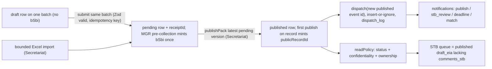

# Cl-HM day prototype — implementation plan (A–I)

Deliverable of [proposal/PLANNING-AGENT-PROMPT.md](proposal/PLANNING-AGENT-PROMPT.md). The locks and [proposal/schemas/events.ts](proposal/schemas/events.ts) win on conflicts; deviations appear only under **Challenge** headings. Behavioural contracts only — no executable TypeScript or SQL in this document.

**Assumptions and ground rules**
- App lives at the CHM repo root (already scaffolded), MIT `LICENSE`, SQLite file in `data/`. `proposal/` stays the EOI pack; this plan is saved at repo root as [`IMPLEMENTATION-PLAN.md`](IMPLEMENTATION-PLAN.md).
- **Source of truth.** `proposal/schemas/events.ts` is authoritative all day. The app holds a byte-identical copy at `src/lib/contracts/events.ts`, guarded by `npm run contracts:check` (diff must be empty; also runs inside `smoke`). Every implementation addition (C1–C3, input schemas) lives in `src/lib/contracts/extensions.ts` and only narrows or extends contract types; it never redefines them. At end of day an explicit amendment diff is proposed for review (todo `contracts-sync`). Nothing becomes canonical mid-build.
- Demo auth = httpOnly cookie holding a seeded `users.id`; no passwords. Authorisation and visibility are enforced by server-side predicates in every action and every read, never only in CSS.
- Dependencies and Node version are frozen before 10:00: `.nvmrc` (Node 22 LTS), `engines`, `.npmrc` with `save-exact=true`, lockfile committed by 09:30. No `@latest` after that.
- Every route handler, page and server module touching SQLite or Excel declares the Node.js runtime; `better-sqlite3` and `exceljs` are listed as server-external packages. Both are verified in local Next.js and in the Debian Docker image before any UI polish.
- Review loose ends closed here: `batch_id_issued` (C1), `BSbi` shape (C2), stubs stay stubs (G).

## A. Exec plan, demo narrative, timebox

Narrative (functions first): the home page shows the five rails — Submit → Review/manage → Publish → Notify → Audit — with live, policy-filtered counts; MGR, EIA and Capacity are the same rails walked with domain data; ABMT is a disabled tab. [proposal/DEMO-SCRIPT.md](proposal/DEMO-SCRIPT.md) is the acceptance script: every step must run unattended by 17:30, and every P0 invariant must be green in `scripts/smoke.ts` first.

Timebox (one Ultra day, 09:00–17:30):
- 09:00–10:00 Scaffold and freeze: `create-next-app` (TS, App Router, Tailwind), `shadcn init`, `better-sqlite3`, `zod`, `exceljs`; exact versions + lockfile committed by 09:30; contracts copied verbatim + `contracts:check`; `extensions.ts`; `db.ts` + `schema.ts` with the `schema_version` gate; `smoke.ts` skeleton listing every P0 invariant (all red); first `docker build` kicked off in the background to prove the native modules load in the image.
- 10:00–11:30 Rails: events outbox with server-side version allocation and idempotency keys, `createPack` / `publishPack`, mints, idempotent `dispatch()` + `dispatch_log`, `reconcile()`, policy predicates, `Bell`, `RailsStrip`, `/audit`. Smoke green: policy, double-publish, dispatch replay, reconcile.
- 11:30–13:00 MGR: `FIELD_DEFS` → form; save draft → submit on the same batch → `receiptId` + `bSbi` → Secretariat publish → `publicRecordId` → bell → audit; template route. Smoke green: B-SBI timing, double-submit, identifier patterns.
- 13:00 **P0 checkpoint — hard gate.** P0 smoke group green **and** demo steps 1–2 plus EIA publish → alert clickable. Failure = hard scope cut: no neighbourhood, live Excel parsing, preferences editing, resolver or matching algorithm until the complete MGR receipt → B-SBI → publish → notify → audit path and the EIA publish → alert path pass smoke.
- 13:30–15:00 EIA: activity page with coexisting pack chips, `NewPackForm` (publishable stages only, conditional `screeningOutcome`), `/stb` queue + `commentStb`, preferences drawer, deadline notification on `draft_eia` publish.
- 15:00–16:00 CBTMT thin: board, need/offer forms, atomic `suggestMatch` (match row + `match_suggested` event), seeded match chip; `suggestMatches()` by shared theme if time allows.
- 16:00–16:45 Bounded Excel import, `/compare` static, ABMT stub, README / DEMO-SCRIPT / LICENSE, Docker re-verified, `db:seed --if-empty` tested on a clean volume.
- 16:45–17:30 Stretch (neighbourhood strip, list only) or end-to-end demo run; `contracts-sync` diff; tag `v0.1`.

## B. Routes (`src/app/`)

- `/` — `RailsStrip` (five rails, policy-filtered live counts, one-line Agreement hook each, deep link to the first action); journey pickers MGR / EIA / Capacity + disabled ABMT; latest published feed (public tier only for public readers).
- `/login` — three demo accounts + STB reviewer; sets the `chm_uid` cookie. Header `RoleSwitcher` dropdown calls the same action.
- `/mgr`, `/mgr/new`, `/mgr/[id]` — policy-filtered list with `?q=` LIKE filter (no Solr); pre-collection form (draft or submit) + "Download offline template (.xlsx)"; batch detail with stage rail, packs, `IdBadge`s, role actions. Editing a draft posts back the same `batchId`.
- `/eia`, `/eia/new`, `/eia/[id]` — list; new activity; detail with stage rail (`scoping_notice` passive), coexisting pack chips, publish buttons (Secretariat), STB comment form on published `draft_eia`, neighbourhood strip (stretch).
- `/stb` — queue: published `draft_eia` packs with no `comments_stb` row for the same (record, version). STB role only.
- `/capacity`, `/capacity/new?kind=need|offer`, `/capacity/[id]` — two-column board, forms, match chips, "Suggest matches" (Secretariat).
- `/abmt` — stub "not in this build"; nav tab rendered disabled with a tooltip on Art 51.3(a)(ii). Keeps the `Domain` enum honest.
- `/records/[publicRecordId]` — resolver → redirect to the owning domain page (persistent public URL, ABSCH pattern); applies `readPolicy` before redirecting (restricted records 404 for public).
- `/audit` — outbox table through `readPolicy`; filters by domain / status / actor role. Two projections: public/party/STB see at, domain, stage, status, actor role, summary, public identifiers only; Secretariat additionally sees actor user, idempotency key and `dispatch_log` outcome. Internal user identifiers and restricted summaries never reach non-Secretariat output.
- `/notifications`, `/notifications/preferences` — full list and `PreferencesForm`; `BellDrawer` (Sheet) in the header reuses the list.
- `/secretariat/inbox`, `/secretariat/import` — pending packs (publish gate, latest version only); Excel import form + per-row result table.
- `/compare` — static content page (interim DOALOS vs prototype), text lifted from `DEMO-SCRIPT.md`; no app chrome, no toggles.
- `/api/template/mgr.xlsx` — route handler streaming the template workbook (Node runtime).
- Mutations = server actions in `src/server/actions/*.ts`, each: `getSessionUser()` → `can()` → Zod parse (input schema from `extensions.ts`) → one domain transaction → `dispatch()` for the event ids returned by the transaction → `revalidatePath()`. Every mutating form carries a hidden idempotency key minted when the form renders.

## C. Data model (`src/db/schema.ts`; JSON TEXT for arrays; foreign keys on; WAL)

Tables and the invariant each constraint protects:
- `meta` — `schema_version`. On start the app compares it with the code constant and refuses to start on mismatch, printing "run `npm run db:reset`". A one-day prototype has no migrations; `CREATE TABLE IF NOT EXISTS` alone is not trusted to detect an obsolete schema.
- `users` — from `User`: id, username (unique), display name, roles JSON, party code, active flag.
- `subscriptions` — from `Subscription`; unique per user (one preference row).
- `notifications` — from `Notification`; **unique (user, event, kind)** so dispatch and replay cannot duplicate.
- `dispatch_log` — implementation table: event id (primary key → events), at, delivered count, error text. Keeps the outbox rows immutable while recording delivery outcome.
- `events` — the outbox; one table for the discriminated union: seq (autoincrement), id (unique), domain, stage, status, record id, related record id, public record id, receipt id, actor role, actor user id, at, summary, artifact refs JSON, confidentiality, version, b_sbi, match id, screening outcome, **idempotency key (unique, nullable)**. Constraints: **unique (record, stage, version, status)** = one transition per status per pack; version ≥ 1; status and domain enumerations checked. Indexes on (record, stage, version, seq), (status, domain, confidentiality), (public record id).
- `mgr_batches` — from `MgrBatch` (title, location hint, **source channel**, confidentiality, version, tkFpicFlag, party code, current stage, updatedAt) + owner user id, details JSON (C3 / D2). Unique b_sbi; unique public record id; a check constraint ties "b_sbi is null" to "current stage is pre_collection" (C1: one mint, at receipt).
- `eia_activities` — from `EiaActivity` (incl. **source channel**, latest pack status) + owner user id; unique public record id.
- `cbtmt_records` — `CbtmtNeed | CbtmtOffer` in one table: kind checked to need|offer; need requires party code, offer requires provider; **source channel**; owner user id; unique public record id.
- `cbtmt_matches` — need id and offer id both foreign keys to `cbtmt_records`, rule, at; **unique (need, offer)**; need ≠ offer (Lock 4).
- `counters` — name (primary key), value; sequences `prid:<domain>:<year>`, `rcpt:<year>`, `bsbi:<party>:<year>`.
- Identifier formats (locked now; smoke asserts each pattern): `publicRecordId` = `BBNJ-<MGR|EIA|CBTMT|ABMT>-<YYYY>-<NNNNN>` — CBTMT spelled in full as in the contract regex, never `CBT`; `receiptId` = `BBNJ-RCPT-<YYYY>-<NNNNN>`; `bSbi` = `BSBI-<PARTY, 2–3 capitals>-<YYYY>-<NNNNN>`. Five-digit zero-padded counters. Smoke also asserts that no `bSbi` matches the `publicRecordId` pattern.
- Cache rule: `current_stage`, `latest_pack_status`, `public_record_id` and `b_sbi` on record rows are **transactional caches**, written in the same transaction as the event that changes them. `reconcile()` recomputes all four from `events` and asserts equality; it runs in smoke and via `npm run db:check`.
- `source_channel` is persisted on all three record tables (`form | excel | assisted`): the form writes `form`, the import writes `excel`, the Secretariat on-behalf submission writes `assisted`.
- Read path maps rows to contract types and parses them; write path parses before insert. Zod is the schema of record; SQL adds keys, uniqueness, checks and foreign keys.

**Challenge C1 — `batch_id_issued`.** Keep the enum value but define it as the batch `currentStage` after a valid receipt: `pre_collection` while draft → `batch_id_issued` once `bSbi` exists → `post_collection` → `utilisation`. One mint only: conditional update where `b_sbi` is null, unique `b_sbi`, and the check constraint above. Dropping the value was rejected: the stage reads well in the rail and in Art 12 narration.

**Challenge C2 — `BSbi` shape.** `extensions.ts` defines `BSbiStrict`, narrowing the contract's open string to the pattern above, captioned "implementation shape — Art 12 fixes the duty, not the format". Write paths validate with the strict shape; the contract file is untouched until `contracts-sync` proposes the amendment.

**Challenge C3 — implementation fields absent from the contract.** `extensions.ts` defines stored variants of the three record types adding `ownerUserId` (so Party users see their own drafts) and `details`; events add `seq` and `idempotencyKey`. All marked implementation fields; none alters a contract type.

## D. Domain logic (`src/server/`, behavioural contracts)

- A pack is the chain of event rows sharing (record, stage, version); the status of the highest-`seq` row is the pack status. Rows are never updated or deleted.
  **Challenge D1** — mutable status + separate audit table rejected: doubles tables and weakens the "append-only outbox" claim.
- **Version allocation** is central and server-side: when a new pack is opened for (record, stage), version = 1 + highest existing version for that pair, computed inside the transaction. Clients never send version numbers; any version in a request is ignored. Unique (record, stage, version, status) guarantees a single transition per status.
- **Idempotency.** Every mutating form carries a hidden idempotency key; a domain function that finds the key already stored returns the original outcome without writing. Publish is keyed by the pack instead: a second publish call finds the latest version already published and returns it unchanged (no rows, no dispatch). Single B-SBI per batch, single `publicRecordId` per record and single match per (need, offer) are each enforced by a unique constraint plus a conditional write, not by application checks alone.
- **Atomicity.** Each logical mutation is one transaction: record caches, event rows and counters commit together or not at all. Dispatch runs only after a successful commit and never rolls back the business write.
- `createPack(record, stage, actor, status, payload, key)` — `can(actor, 'submit', record)`; `pending` requires the full input to validate; mints `receiptId` on pending for every domain; writes event + caches.
- `publishPack(recordId, stage, actor)` — `can(actor, 'publish')` (secretariat or `publishing_authority`, captioned ABSCH analogue). One transaction: resolve the **latest** version for (record, stage); refuse unless its latest row is `pending` — distinct errors for "already published" and "stale: a newer version exists"; mint `publicRecordId` only if the record has none (conditional update + unique); insert the `published` row copying summary and artefacts and carrying `publicRecordId`; update caches; **return the new published event id**. The action dispatches that id, not the pending one.
- **MGR receipt.** `saveMgrDraft(input, actor, key)` creates or updates **one** batch (the form posts `batchId` when editing) and keeps a `draft` row on it. `submitPreCollection(batchId, edits, actor, key)` validates the merged input, mints `bSbi` once (conditional update where null), sets `current_stage = batch_id_issued`, writes the `pending` pre_collection row with `receiptId` and `bSbi` — one transaction. `receivePreCollection(input, actor, sourceChannel, key)` = create + submit in one transaction (form submit without a prior draft; Excel import). Submitting an existing draft never creates a second batch or a second B-SBI.
- **Mints** — per-domain, per-year counters incremented in the same transaction as the write that uses them; formats as locked in C.
- **Policy** (`src/server/policy.ts`). `getSessionUser()` reads the cookie; missing, malformed, unknown or inactive → anonymous public principal (reads as public, every mutation refused). `can(user, action, subject)` covers `submit` (party on own records; secretariat on behalf → `assisted`), `publish` (secretariat, publishing_authority), `comment_stb` (stb), `import` and `suggest_match` (secretariat), `manage_subscription` (self). `readPolicy(user)` returns a policy object — allowed statuses, allowed confidentiality tiers, owner id — and a single query helper applies it to every list, detail, count, feed, audit query and the `/records` resolver. Nobody writes visibility conditions by hand.
  - Status: public and STB → published only (Lock 2); party → published plus own records' drafts and pending; secretariat → all.
  - Confidentiality: `public` → everyone; `restricted` → secretariat, owner, STB; `confidential` → secretariat and owner. Restricted and confidential rows never enter public feeds, counts, alerts or audit output.
- **STB.** Queue = published `draft_eia` packs lacking a `comments_stb` row for the same (record, version). `commentStb(activityId, actor, text, key)` — `can(actor, 'comment_stb')`; writes one row with stage `comments_stb`, status published, version = the draft version. One consolidated STB comment per draft version (STB is one body); a second call is refused as already commented. Page caption "published ≠ final decision".
- **EIA packs.** Publishable stages only; `screeningOutcome` required on published screening (contract refinement); `scoping_notice` is a passive rail step, never a row; caches updated per transaction.
- **`dispatch(eventId)`** — after commit, synchronous, no queue. Recipients = (record owner ∪ subscription matches on domains / abnjBoxes / themes ∪ role targets) ∩ users permitted by `readPolicy` for that event. Inserts with insert-or-ignore under unique (user, event, kind); writes `dispatch_log` with count or error; failure is logged and shown to Secretariat in `/audit`, never re-thrown into the business path. Kinds: `publish`; `stb_review` (draft_eia published → STB users); `deadline` (draft_eia published → subscribers, "comment window closes at publish + 30 days — demo value; the Agreement fixes no day count here"); `match` (match_suggested → need owner). `digest` is seeded only. `scripts/replay-outbox.ts` re-runs dispatch over all events without truncating anything; on a consistent database it inserts zero rows (smoke asserts).
- **CBTMT.** `createNeed` / `createOffer` → pending pack → Secretariat publish. `suggestMatch(needId, offerId, rule, actor, key)` — one transaction: both records published and distinct; insert-or-ignore into `cbtmt_matches`; only when a row was inserted, write the `match_suggested` event with `matchId`, `recordId` = need, `relatedRecordId` = offer; otherwise return the existing match. `suggestMatches()` = deterministic shared-theme intersection, rule `shared_theme:<theme>`. No ML.
- **`FIELD_DEFS`** (`src/lib/mgr-fields.ts`) is the single source for MGR pre-collection fields: key, label, required, kind, Agreement basis or "implementation", help text, Excel header. The Zod input schema is built from `FIELD_DEFS`; the form, the template header row, the field-guide sheet and the import header map all read `FIELD_DEFS`. No runtime introspection of refined Zod schemas.
- **Excel template** (`/api/template/mgr.xlsx`): sheet "Meta" with template name `mgr-pre-collection` and template version 1; sheet "Data" with the header row from `FIELD_DEFS`; sheet "Field guide" from `FIELD_DEFS`.
- **Excel import** `importMgrExcel(file, onBehalfOfPartyCode, actor, key)` — `can(actor, 'import')`; `.xlsx` only; ≤ 2 MB; Meta sheet must carry the expected template name and version; headers compared after trim and case normalisation and must equal `FIELD_DEFS` exactly (unknown or missing headers reject the file); blank rows skipped; ≤ 200 data rows; formula cells produce a row error (values only, no evaluation, no cached results); each row runs `receivePreCollection(..., 'excel', rowKey = key + row index)` in its **own** transaction and returns ok or the Zod error list. Re-posting the same upload yields no duplicates. Fallback if time slips: "Import sample" button feeding `public/fixtures/mgr-sample.xlsx` through the same code path.

**Challenge D2 — pre-collection content.** Add optional Art 12.2-traceable entries to `FIELD_DEFS` (objectives, geographical area, method and means incl. vessel, sponsoring institution / person in charge, expected dates, participation opportunities for developing States, data-management plan), stored in `mgr_batches.details`, each carrying its Agreement basis. Verify sub-paragraph letters against the Agreement text before labelling. Cut = keep `title` / `locationHint` / `tkFpicFlag` only.

## E. UI inventory

Visual identity follows `VISUAL-CHARTER.md` ("Working Cl-HM desk": cool canvas, one UN-adjacent blue, text-labelled status chips, journeys secondary to shared rails). Charter tokens live in `src/app/globals.css` mapped onto the shadcn theme; the status chip in `src/components/chips.tsx` is the single source for `draft` / `pending` / `published` colour.

shadcn additions: button, card, badge, tabs, sheet, input, select, textarea, checkbox, switch, table, tooltip, dropdown-menu, alert, separator, sonner. Forms are plain server-action forms with Zod flattened errors and a hidden idempotency key; no react-hook-form. Submit and publish buttons disable while pending; the server stays safe regardless.

Shared rails (build first):
- `AppShell` — header tabs (MGR · EIA · Capacity · ABMT disabled · Audit), `RoleSwitcher`, `Bell`; footer "MIT · demo · without prejudice to COP1".
- `RailsStrip` / `RailCard` (policy-filtered count + Agreement hook + CTA).
- `StatusBadge`, `PackChip` (stage · status · version), `IdBadge` (short UUID / `publicRecordId` / `bSbi`, tooltip "Art 12 B-SBI ≠ CHM record id"), `ConfidentialityBadge`, `SourceChannelBadge`, `TkFpicBadge`.
- `EventTimeline` (per record), `AuditTable` (public and Secretariat projections), `EmptyState`, `PageHeader`.
- `BellDrawer` (Sheet), `NotificationRow`, `PreferencesForm` (domains, themes, abnjBoxes, digest).
- `DownloadTemplateButton`, `ImportForm` + `ImportResultTable`, `PublishButton` (Secretariat, latest pending version only), `RoleGate` (server-side affordance helper; actions re-check via `can()`).

Journeys (second):
- MGR: `MgrList`, `PreCollectionForm` (rendered from `FIELD_DEFS`; save draft / submit on the same batch), `MgrBatchDetail` with `StageRail` (pre_collection → batch_id_issued → post_collection → utilisation), `AddPackForm`.
- EIA: `EiaList`, `EiaActivityDetail` (`StageRail` with passive scoping_notice, `PackChip`s, `NewPackForm`, `StbCommentForm`), `StbQueue`.
- CBTMT: `Board` (needs | offers), `NeedOfferForm`, `MatchChip`, `SuggestMatchesButton`.
- ABMT: disabled tab + `/abmt` stub. Compare: `/compare` plain TSX content.

Stretch (last): `NeighbourhoodStrip` — other public activities in the same `abnjBox`, list only, no map.

## F. Seeds and database commands

- `npm run db:seed -- --if-empty` — startup path (Docker entrypoint). Never deletes anything; no-op when `users` is non-empty.
- `npm run db:reset` — development and tests only: deletes `data/chm.sqlite`, recreates the schema, seeds. Refuses when `NODE_ENV=production` unless `--force`.
- `npm run db:check` — runs `reconcile()` and `contracts:check`.
- Seeds go through the domain functions with **fixed idempotency keys**, never raw inserts; re-running the seed on a seeded database writes zero rows (asserted).
- Users (4 rows: "three logins + STB reviewer"): `party.nfp` [party], party code `XSD` (ISO user-assigned range → "Demo Party (SIDS)", no real State implied); `secretariat` [secretariat]; `public` [public]; `stb` [stb].
- Vocab: `AbnjBox` enum as-is (CCZ, Reykjanes Ridge, Clarion-Clipperton South); CBTMT themes `taxonomy`, `genomics`, `eia_practice`.
- MGR: A "Deep-sea sampling cruise DEMO-01" — `receivePreCollection` → published (`BSBI-XSD-2026-00001`, `BBNJ-RCPT-2026-00001`, `BBNJ-MGR-2026-00001`) + pending `post_collection` pack (coexistence); B draft only (no `bSbi` — proves mint at receipt, not at save); C imported from the fixture, `sourceChannel: excel`, pending; D "Restricted cruise DEMO-02" — published with confidentiality `restricted` (visible to Secretariat, owner and STB; absent from public feeds, counts, audit and notifications).
- EIA: 1 "Acoustic survey, Reykjanes Ridge" — published `screening` `no_eia`; 2 "Sediment sampling, CCZ" — published `screening` `eia_required` + `planned_activity_notice` + `draft_eia` (→ STB queue, `deadline` notification) + pending `decision_conditions`; 3 "Baseline survey, CCZ" — published `screening` + draft `draft_eia` (Lock 1 coexistence; feeds the neighbourhood strip and the public user's CCZ subscription).
- CBTMT: need "Taxonomic training for deep-sea samples" (XSD, [taxonomy, genomics]) + offer "Marine genomics lab placements" (provider "Demo Ocean Tech Consortium", [taxonomy]) → `suggestMatch` with rule `shared_theme:taxonomy` (match row + `match_suggested` in one transaction).
- Subscriptions: `party.nfp` {domains [mgr, cbtmt], daily}; `public` {abnjBoxes [CCZ], domains [eia], immediate}; `stb` {domains [eia]}. Notifications arise from `dispatch()` during seeding, plus one seeded `digest` row.
- Counters end consistent with minted ids; `scripts/smoke.ts` runs on a temporary database.

## G. WBS and cut order

- Lane 1 — App / Zod / rails: scaffold + freeze; contracts copy + `contracts:check` + `extensions.ts`; `db.ts` / `schema.ts` + `schema_version` gate; `policy.ts` (`getSessionUser`, `can`, `readPolicy`, query helper); pack machine (version allocation, idempotency, mints, publish, `reconcile`); `dispatch` + `dispatch_log` + replay; server actions; template route; import; Dockerfile + compose (`node:22-bookworm-slim`, full `node_modules`, `data/` volume, entrypoint `db:seed --if-empty` then `next start`).
- Lane 2 — UI: shell + rails + role switcher + bell → MGR pages → EIA pages + `/stb` → CBTMT board → preferences → `/compare`, `/abmt` → neighbourhood.
- Lane 3 — Smoke / seeds / docs: `smoke.ts` skeleton first (all P0 invariants red before feature work), then `seed.ts`, fixture `.xlsx`, `replay-outbox.ts`, README (DOALOS table, latency / payload budget, logins, licence), `DEMO-SCRIPT.md`, `LICENSE`, `contracts-sync` diff.
- P0 by 13:00 (hard gate): P0 smoke group green · home rails · MGR submit → `bSbi` → publish → `publicRecordId` → bell → audit · EIA publish → alert.
- Cut order if behind (applied in full on a failed gate): 1 neighbourhood strip; 2 live Excel parse (fixture import button stays); 3 `suggestMatches()` rule (seeded match stays); 4 `/compare` page (README + slide stay); 5 preferences editing (read-only display stays); 6 `/records/[publicRecordId]`; 7 sequence polish (counters stay). Never cut: policy, idempotency, atomicity, `contracts:check`, smoke.

## H. Risks and Glen questions

- Native modules: `better-sqlite3` and `exceljs` as server-external packages; Node runtime declared on every touching route; Debian-based image (prebuilt binaries) with `python3 make g++` in the build stage as fallback; first Docker build at ~09:45, re-verified before UI polish.
- SQLite features relied on (upsert with returning, partial/conditional updates, foreign keys): confirmed at scaffold against the bundled SQLite version; fall back to two-statement counters if needed.
- Schema drift during rapid iteration: `schema_version` gate + `db:reset`; no silent `IF NOT EXISTS` reuse.
- Append-only vs single transition: unique (record, stage, version, status) makes retries safe but means STB comments are one consolidated row per draft version — stated in the UI.
- Server actions + cookies: `cookies()` inside actions; `revalidatePath` after every mutation; visibility computed server-side only; anonymous principal for bad cookies.
- Dispatch failure visibility: `dispatch_log` errors surface in Secretariat `/audit`; replay repairs gaps without duplicates.
- Time: forms and drawers eat hours — plain forms, one Sheet component reused; `FIELD_DEFS` avoids hand-built form/template drift.
- Legal wording: every badge / caption says "demo" or "implementation field"; `publishing_authority` captioned as ABSCH analogue; footer "without prejudice to COP1".
- Seed drift: seeds run through the domain functions with fixed keys, so they break loudly when logic changes and stay idempotent.
- Glen questions: none blocking after the locks. Defaults taken, reversible in minutes: demo Party code `XSD` rather than a real State; STB as a fourth seeded account rather than a second role on `public`; repo name `bbnj-chm-proto`; author / presenting-entity line in README left as a placeholder pending the 14 Sep cluster call.

## I. Acceptance (each is a `smoke.ts` assertion or a `DEMO-SCRIPT.md` step; P0 group must be green at 13:00)

- `contracts:check` passes: app copy byte-identical to `proposal/schemas/events.ts`.
- Home shows five rails with policy-filtered live counts before any journey link; public counts equal public list lengths.
- Batch A: `bSbi` set at receipt while `publicRecordId` is null; after publish both present, `bSbi` unchanged; batch B has no `bSbi`. Identifier patterns hold for `publicRecordId` (CBTMT spelled in full), `receiptId` and `bSbi`; no `bSbi` matches the `publicRecordId` pattern.
- Draft → submit yields exactly one batch and one B-SBI; submitting twice with the same idempotency key writes nothing new; publishing twice yields one published row and one dispatch; publishing a stale (non-latest) pending pack is refused; a client-supplied version is ignored.
- `public` and `stb` reads return zero draft / pending rows; `stb` sees published `draft_eia` for activity 2; `/stb` queue empties after `commentStb`; a second `commentStb` on the same draft version is refused; `stb_review` + `deadline` notifications exist.
- Restricted batch D is absent from public feed, counts, audit and notifications, and present for Secretariat, owner and STB. Missing, malformed or inactive cookie behaves as public; mutations are refused.
- `reconcile()` finds caches equal to event-derived values after seeding and after the demo journey.
- Replay over the outbox inserts zero notifications on a consistent database; `dispatch_log` has one row per dispatched event.
- `cbtmt_matches` insert with an unknown `offer_id` fails (foreign keys on); duplicate (need, offer) is ignored without a second event; the seeded `match_suggested` event carries `matchId`.
- `/api/template/mgr.xlsx` returns a workbook with Meta, Data and Field-guide sheets; importing the fixture yields a batch with `sourceChannel: excel` and a `bSbi`; a file with a wrong template version, unknown headers, more than 200 rows or a formula cell is rejected or row-errored as specified.
- Public `/audit` output contains no internal user identifiers and no restricted summaries.
- `db:seed --if-empty` on a seeded database changes nothing; `db:reset` refuses under `NODE_ENV=production`; schema-version mismatch refuses start.
- `/compare` renders; README carries the DOALOS contrast and a latency / payload budget; `DEMO-SCRIPT.md` carries the slide.
- README states MIT, sandbox URL placeholder, Docker Compose, three logins + STB; `LICENSE` present.
- ABMT tab disabled with tooltip; `Domain` includes `abmt`; `/abmt` renders the reservation note.
- `docker compose up` on a clean checkout and empty volume serves the seeded app on `:3000`.
