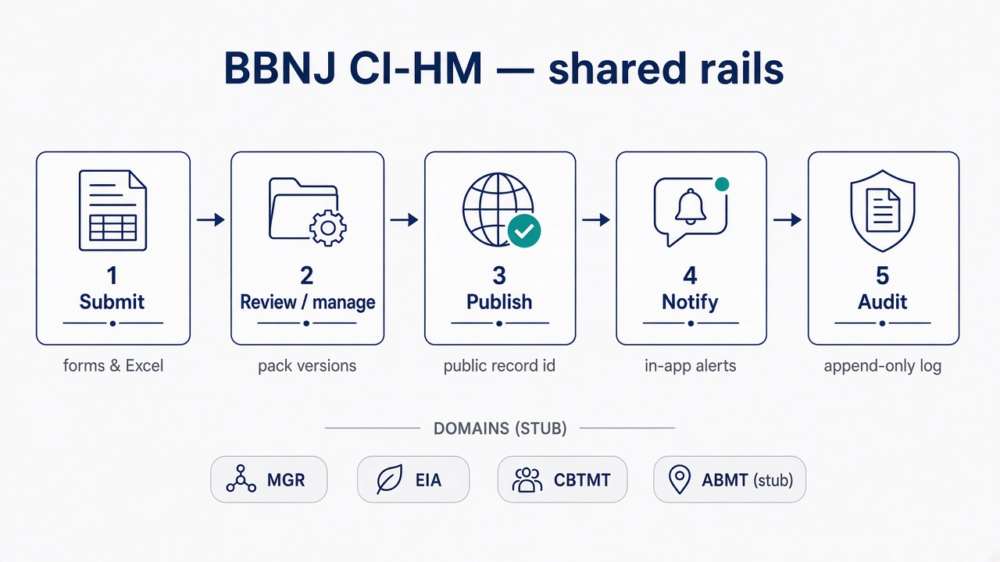
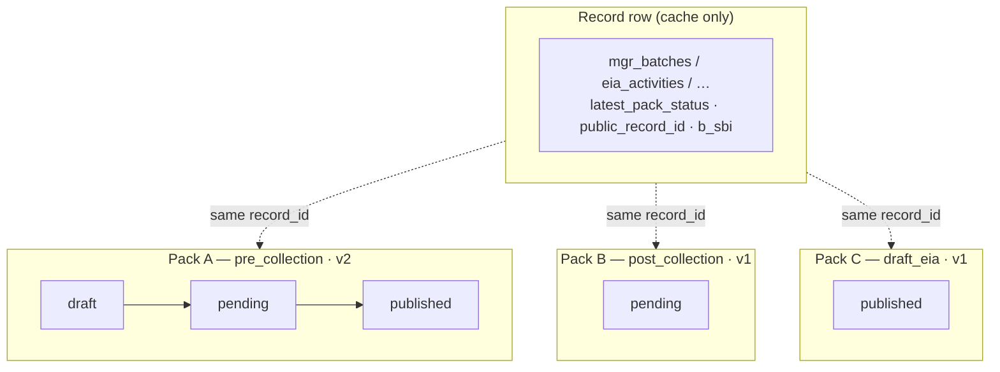
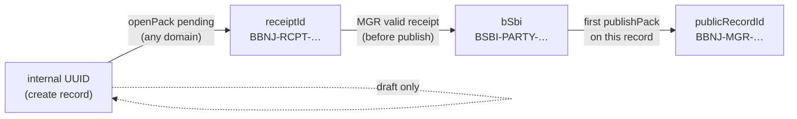
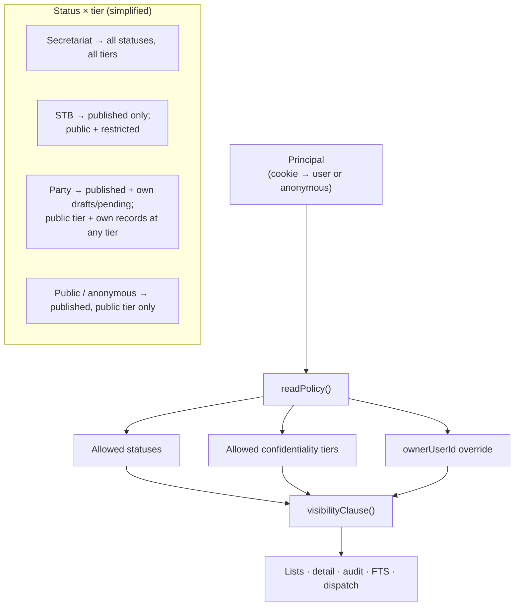
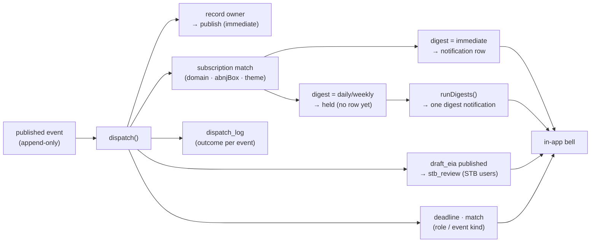

# BBNJ Cl-HM prototype

A **working prototype** of the BBNJ Agreement’s Clearing-House Mechanism (Cl-HM): one shared set of rails — **submit → review/manage → publish → notify → audit** — walked through marine genetic resources (MGR), environmental impact assessments (EIA), capacity-building / technology transfer (CBTMT), and a thin ABMT stub.

Built for **Party and Secretariat staff, reviewers, and anyone comparing a transactional desk to the interim informational pages**. MIT-licensed. Without prejudice to COP1.

Repository: [github.com/glen-w/BBNJ-CHM-proto](https://github.com/glen-w/BBNJ-CHM-proto)



---

## In brief

| | |
|---|---|
| **What it is** | A working **desk**, not a brochure site: Parties submit structured records; an authorised publisher releases them; subscribers get alerts; every step is auditable. |
| **Why it exists** | To show what a *transactional* Cl-HM adds beside the interim DOALOS informational set-up (documents, meetings, contacts) — a **design contrast**, not a critique. |
| **How to try it** | Clone or Docker — **no hosted public URL yet**. Five passwordless logins for local evaluation. |
| **What to open first** | `DEMO-SCRIPT.md` (10‑minute walk-through) · [`/compare`](http://localhost:3000/compare) after start |

**Hands-on in one line:** `npm ci && npm run db:seed && npm run dev` — or `docker compose up --build` — then sign in at `/login`.

### What you can demonstrate today

- **Structured intake** — forms plus offline Excel (MGR pre-collection and EIA screening), with an error workbook for failed rows  
- **Identifiers in order** — receipt → Art 12 **B-SBI** at valid MGR receipt (before publish) → public record id at first publish; never swapped  
- **Pack status, not record status** — draft / pending / published on each pack so stages can coexist  
- **Roles enforced on the server** — Party, Secretariat, public, STB, non-State uploader; every refusal is logged  
- **Confidentiality tiers** — public / restricted / confidential on every list, export and notification  
- **Notify semantics** — in-app bell, hold + digest (no e-mail yet); optional digest CSV for the Secretariat  
- **Search** — policy-aware full-text search so restricted rows never leak to public readers  
- **Honesty labels** — Interim (DOALOS) vs Demo scenario badges so seed storylines are not read as real filings  

Caveats stay in docs (and this README), not in product chrome: illustrative Party **XSD** (no real State), cookie logins, ABMT is a stub, notifications are in-app only, Excel is an Art 51.5 **pattern** not a WCAG certificate, PDF export is a stub.

### Evaluation logins (`/login`)

| Username | Who it stands for | What they can do |
|---|---|---|
| `party.nfp` | Demo Party **XSD** | Own drafts/pending + published; submit MGR, EIA, CBTMT needs, ABMT stubs |
| `secretariat` | Authorised publishing role | Publish, import Excel, match CBTMT, facilitation notes, digests, full audit |
| `public` | Public reader | Published, public-tier only |
| `stb` | STB reviewer | Published + restricted; draft-EIA review queue |
| `nonstate.uploader` | Registered non-State provider | **CBTMT offers only** — other submissions refused and logged |

No passwords. A bad cookie = anonymous public.

### Interim set-up vs this desk

| | Interim (as understood from public materials) | This prototype |
|---|---|---|
| Intake | Documents and contact points | Forms + offline Excel + closed import loop |
| Identifiers | No Art 12 B-SBI yet (expected) | B-SBI at receipt; public id at publish |
| Versioning | Documents re-posted | Amend → pending v+1; material change re-notifies |
| Confidentiality | Not surfaced on public pages | Three tiers in every read path |
| Roles | Secretariat-published content | Five roles, server-enforced |
| Notify | None visible | Outbox → subscriptions → in-app digests |
| Audit | Not surfaced | Append-only transitions + refusal log |

Full table and deep links: `/compare` (docs-style page; not in primary nav).

---

## Roadmap (sensible next waves)

What this release already proves vs what a production Cl-HM would still need. Waves are indicative, not a COP1 workplan.

| Wave | Focus | Would add |
|---|---|---|
| **Now (this repo)** | Working prototype | Shared rails, five roles, Excel pattern, in-app notify, FTS search, ABMT stub, clone/Docker hands-on |
| **Wave A — Operate the desk** | Day-to-day Secretariat use | **Admin backend** (users, roles, vocabularies, seed/reset controls, import monitoring); scheduled digests; richer audit filters; hosted **public URL** if required |
| **Wave B — Reach people** | Alerts beyond the browser | **E-mail / SMTP notifications** (and optional SMS later) on the same outbox semantics; preference centre that matches real channels; digest templates |
| **Wave C — Trust & access** | Production posture | Real authentication (e.g. OAuth / institutional IdP), TLS, session hardening; formal WCAG audit; six-language UI (treaty-text links already stubbed) |
| **Wave D — Content & geography** | Deeper records | File/object store for artifacts (today: references only); map/GIS neighbourhood as progressive enhancement; ABMT content beyond `proposal_stub` when COP1 clarifies |
| **Wave E — Interoperate** | Ecosystem | Federation / node protocol on the outbox; search beyond SQLite FTS (e.g. Solr); machine-readable exchange with related clearing-houses (today: named links only) |

---

## For implementers

Technical reference below. Product framing for non-engineers stops above.

### Quick start

```bash
nvm use            # Node 22 (.nvmrc); engines allow Node >=22 <27
npm ci
npm run db:seed    # idempotent seed (smoke fixtures + fixtures/bbnj-chm-seed-pack CSVs)
npm run dev        # http://localhost:3000
```

```bash
docker compose up --build
```

Health: [`/api/health`](http://localhost:3000/api/health). Walk-through: `DEMO-SCRIPT.md`. Unattended: `npm run demo`.

> **Schema v6.** After a pull, if start throws `SchemaVersionError`, run `npm run db:reset` (Docker: `docker compose down -v`).

### The four locks (as built)

1. **Pack status, not record status** — `draft → pending → published` on each pack; records only cache the latest stage.  
2. **STB sees published draft EIAs only** — one consolidated comment per draft version.  
3. **Identifiers in order** — `internalId` → `receiptId` → **`bSbi`** (MGR receipt, before publish) → `publicRecordId` (first publish).  
4. **CBTMT match = row + event** — `cbtmt_matches` inserted atomically with `match_suggested`; shared-theme rule + human facilitation note (not ML).

### Key patterns (diagrams)

#### 1. Pack & outbox — status lives on packs, not records

A **pack** is the chain of append-only `events` rows sharing `(record_id, stage, version)`. The highest-`seq` row is the pack status. One record can carry many packs at once (Lock 1).



`UNIQUE (record_id, stage, version, status)` guarantees one transition per status; rows are never updated or deleted. `reconcile()` recomputes record caches from the outbox.

#### 2. Identifier mint order

Ids are minted inside the domain transaction that earns them. `bSbi` and `publicRecordId` are never interchangeable.



#### 3. Read policy — one visibility clause everywhere

Every list, detail, feed, audit query, FTS hit and notification fan-out goes through `readPolicy()` + `visibilityClause()`. Nobody writes tier/status SQL by hand.



#### 4. Notify dispatch — outbox → bell (with digest hold)

`dispatch()` runs synchronously after commit. Recipients are subscription matches ∩ users who can read the event. Daily/weekly subscribers are held until `runDigests()`.



`INSERT OR IGNORE` under `UNIQUE (user_id, event_id, kind)` makes replay safe; `scripts/replay-outbox.ts` must insert zero rows on a consistent database.

### Stack & scripts

Next.js 16 App Router · TypeScript · Zod 4 · shadcn/ui · `better-sqlite3` · `exceljs` · Node 22 · Docker Compose · MIT (`save-exact`, lockfile committed).

```bash
npm run smoke            # 36 acceptance tests on a temp DB
npm run db:seed          # idempotent; --if-empty for startup
npm run db:reset         # DEV/TEST ONLY (refused in production)
npm run db:check         # contracts:check + reconcile
npm run digest           # roll held publications into digest rows
npm run demo             # 17 narrated checkpoints; BASE_URL=… adds HTTP checks
npm run contracts:check  # locked Zod contract loads
npm test                 # Vitest
```

Environment: `DATABASE_PATH` (default `data/chm.sqlite`); `SANDBOX_RESET=1` (or `force` in a hosted evaluation image) for Secretariat *Reset database*.

**Latency / SIDS:** SSR HTML, native forms (works without client JS), no map tiles; offline Excel is the Art 51.5 pattern proof — not a WCAG certification (`ACCESSIBILITY.md`).

### Guarantees (`npm run smoke`)

**36 tests** on a throwaway SQLite file: contract load, schema gate, identifiers, role predicates (incl. non-State uploader), public/STB never see draft/pending, FTS never leaks restricted/confidential, B-SBI timing, idempotency, STB queue, Lock 1 coexistence, tiers, import closed loops (MGR + EIA), amendments, ABMT stub, facilitation notes, digest export, reconcile/replay, seed idempotency.

### Layout (code map)

| Path | Purpose |
|---|---|
| `src/lib/contracts/events.ts` | Locked Zod contract |
| `src/lib/contracts/extensions.ts` | Implementation extensions only |
| `src/lib/db/` | Schema **v6** + `schema_version` gate |
| `src/server/policy.ts` | `can()` / `requireCan()` / single visibility clause |
| `src/server/packs.ts` | Version allocation, publish, amend |
| `src/server/notify.ts` / `digest.ts` | Dispatch, hold, digests |
| `src/server/{mgr,eia,cbtmt,abmt}.ts` | Domain journeys |
| `src/app/` | Pages, actions, templates, exports, health |
| `scripts/` | smoke, demo, seed, digest, replay-outbox, … |

### Further reading

| File | Purpose |
|---|---|
| `DEMO-SCRIPT.md` | Presenters / walk-through |
| `VISUAL-CHARTER.md` | UI identity |
| `ACCESSIBILITY.md` | WCAG assessment |

Internal planning archives (EOI checklists, original `proposal/` pack, hardening ledger) live in `internal/` — **gitignored**. After a fresh clone: `npm run internal:restore`.

### Scope notes (short)

- No hosted public URL; no SMTP; ABMT = stub; related-systems links in About this desk = links, not federation.  
- Illustrative values (30‑day EIA window, B-SBI shape, “material change”) are labelled implementation choices.  
- `/cbtmt` redirects to `/capacity`.

---

MIT · without prejudice to COP1.
