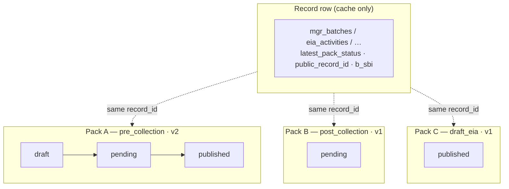
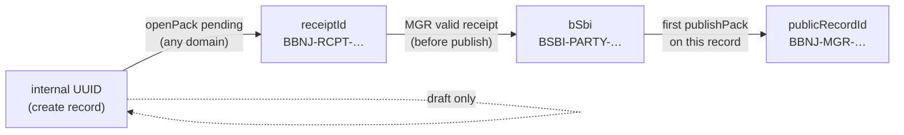
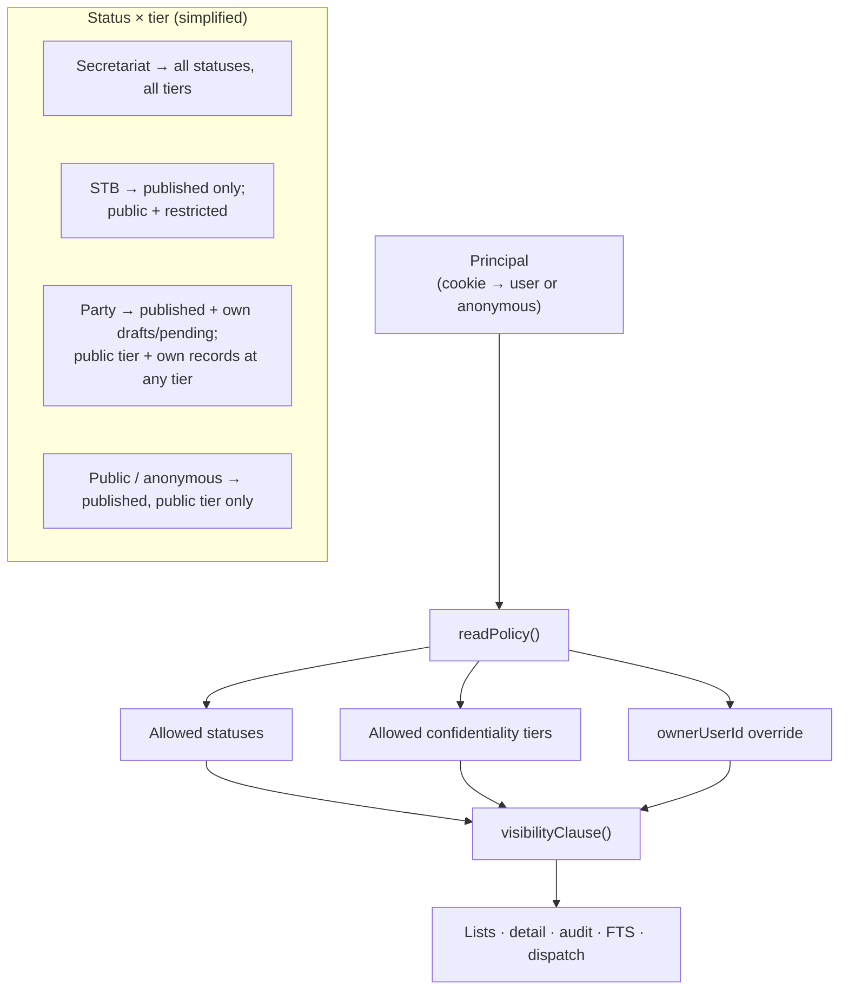
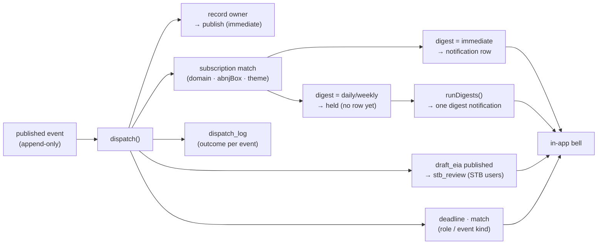

# BBNJ Cl-HM prototype

A **working prototype** of the BBNJ Agreement’s Clearing-House Mechanism (Cl-HM): one shared set of rails — **submit → review/manage → publish → notify → audit** — walked through marine genetic resources (MGR), environmental impact assessments (EIA), capacity-building / technology transfer (CBTMT), and a thin ABMT stub.

Built for **Party and Secretariat staff, reviewers, and anyone comparing a transactional desk to the interim informational pages**. MIT-licensed. Without prejudice to COP1.

Repository: [github.com/glen-w/BBNJ-CHM-proto](https://github.com/glen-w/BBNJ-CHM-proto)

---

## In brief

| | |
|---|---|
| **What it is** | A working **desk**, not a brochure site: Parties submit structured records; an authorised publisher releases them; subscribers get alerts; every step is auditable. |
| **Why it exists** | To show what a *transactional* Cl-HM adds beside the interim DOALOS informational set-up (documents, meetings, contacts) — a **design contrast**, not a critique. |
| **How to try it** | Clone or Docker — **no hosted public URL yet**. Five passwordless logins for local evaluation. |
| **What to open first** | `DEMO-SCRIPT.md` (10‑minute walk-through) · [`/compare`](http://localhost:3000/compare) after start |

**Hands-on in one line:** `npm ci && npm run db:seed && npm run dev` — or `docker compose up --build` — then sign in at `/login`.

### What you can demonstrate today

- **Structured intake** — forms plus offline Excel (MGR pre-collection and EIA screening), with an error workbook for failed rows  
- **Identifiers in order** — receipt → Art 12 **B-SBI** at valid MGR receipt (before publish) → public record id at first publish; never swapped  
- **Pack status, not record status** — draft / pending / published on each pack so stages can coexist  
- **Roles enforced on the server** — Party, Secretariat, public, STB, non-State uploader; every refusal is logged  
- **Confidentiality tiers** — public / restricted / confidential on every list, export and notification  
- **Notify semantics** — in-app bell, hold + digest (no e-mail yet); optional digest CSV for the Secretariat  
- **Search** — policy-aware full-text search so restricted rows never leak to public readers  
- **Honesty labels** — Interim (DOALOS) vs Demo scenario badges so seed storylines are not read as real filings  

Caveats stay in docs (and this README), not in product chrome: illustrative Party **XSD** (no real State), cookie logins, ABMT is a stub, notifications are in-app only, Excel is an Art 51.5 **pattern** not a WCAG certificate, PDF export is a stub.

### Evaluation logins (`/login`)

| Username | Who it stands for | What they can do |
|---|---|---|
| `party.nfp` | Demo Party **XSD** | Own drafts/pending + published; submit MGR, EIA, CBTMT needs, ABMT stubs |
| `secretariat` | Authorised publishing role | Publish, import Excel, match CBTMT, facilitation notes, digests, full audit |
| `public` | Public reader | Published, public-tier only |
| `stb` | STB reviewer | Published + restricted; draft-EIA review queue |
| `nonstate.uploader` | Registered non-State provider | **CBTMT offers only** — other submissions refused and logged |

No passwords. A bad cookie = anonymous public.

### Interim set-up vs this desk

| | Interim (as understood from public materials) | This prototype |
|---|---|---|
| Intake | Documents and contact points | Forms + offline Excel + closed import loop |
| Identifiers | No Art 12 B-SBI yet (expected) | B-SBI at receipt; public id at publish |
| Versioning | Documents re-posted | Amend → pending v+1; material change re-notifies |
| Confidentiality | Not surfaced on public pages | Three tiers in every read path |
| Roles | Secretariat-published content | Five roles, server-enforced |
| Notify | None visible | Outbox → subscriptions → in-app digests |
| Audit | Not surfaced | Append-only transitions + refusal log |

Full table and deep links: `/compare` (docs-style page; not in primary nav).

---

## Roadmap (sensible next waves)

What this release already proves vs what a production Cl-HM would still need. Waves are **indicative**, not a COP1 workplan and not a hosting commitment. Themes below can run in parallel; identifiers, pack status, `readPolicy()`, and the outbox stay the substrate.

| Wave | Focus | Would add |
|---|---|---|
| **Now (this repo)** | Working prototype | Shared rails, five roles, Excel pattern, in-app notify, FTS search, ABMT stub, clone/Docker hands-on |
| **Wave A — Operate the desk** | Day-to-day Secretariat use | **Admin / user-management backend**; vocabularies; scheduled digests; import monitoring; richer audit filters; hosted **public URL** if required |
| **Wave B — Reach people** | Alerts beyond the browser | **SMTP** (optional SMS later) on the same outbox; **mailing lists / circulars** vs transactional notify; preference centre with real channels and unsubscribe |
| **Wave C — Trust & language** | Production posture | Institutional IdP / OAuth, TLS, session hardening; **six-language UI by human i18n** (treaty-text links already stubbed); formal WCAG audit |
| **Wave D — Content & geography** | Deeper records | File/object store for artifacts (today: references only); **tile/GIS neighbourhood** as progressive enhancement (schematic ABNJ diagram ships now); ABMT content beyond `proposal_stub` when COP1 clarifies |
| **Wave E — Interoperate** | Ecosystem | Versioned **API + webhooks**; federation / node protocol on the outbox; search beyond SQLite FTS; machine-readable exchange with related clearing-houses (today: named links only) |
| **Cross-cut** | Assist, hosting & proof | Guarded **LLM assist** (never authority) incl. CBTMT match-card UX (rule vs facilitation split); **printable EOI exhibit** one-pager from live DB; pick an **infrastructure pathway**; grow **testing** with each seam without replacing `npm run smoke` |

### Translation — need and modalities

PrepCom3: English-first prototype, six UN languages later, with an **explicit caution against ungoverned AI translation**. The desk already opens the official BBNJ text in those six languages and persists the choice (Arabic RTL on the masthead only). UI strings stay English. That is a locale stub, not i18n.

The need is real: NFPs, non-State providers, STB reviewers and public readers do not all work in English, and Art 51.5 “without undue burden” includes language. Modalities to choose later — not all at once:

| Layer | Sensible modality | What not to do |
|---|---|---|
| **Treaty text** | Link the official UN pages (already stubbed). Never retranslate the Agreement. | Machine-translated articles as “the text”. |
| **Chrome / forms / notify** | Human (or professionally reviewed) message catalogs in ar / zh / en / fr / ru / es; RTL for Arabic; subscriber language on digests. | Shipping browser-plugin MT as an official offering. |
| **Controlled vocabularies** | Official equivalents for stages, themes, ABNJ boxes, confidentiality labels. | Free-text MT of coded terms. |
| **Record content** | Store `contentLanguage` on the pack; submitter language is the source. Optional later: labelled convenience translation vs a human-certified pack. | Silent overwrite of the filed language. |
| **Assisted MT** | Only as a human aid (draft a catalog string, never publish it). Log the modality; human sign-off. | Ungoverned MT of filings, notifications, or treaty cites. |

UI i18n is Wave C; record-language and vocabulary translation can trail chrome. Search and `visibilityClause()` must stay language-agnostic on identifiers and tiers.

### AI / LLM integration

Shipped on purpose without models: CBTMT match is a **deterministic shared-theme join plus a human facilitation note**; search is policy-aware FTS; no auto-publish, no auto-redact.

If a later build uses an LLM, it is an **assistant**, not a rail. Same `readPolicy()` as every other read path; confidential and restricted rows never leave the allowed set; every assist is auditable.

| May help (human confirms) | Must not |
|---|---|
| Explain a form field; suggest themes or ABNJ boxes | Mint `receiptId` / B-SBI / `publicRecordId` |
| Draft a Secretariat facilitation note; surface **rule-found pair vs human facilitation** on CBTMT match cards | Publish, amend, or change confidentiality |
| Reformulate a public search query; summarise a **public** record | Replace CBTMT matchmaking or STB review |
| Help translate **UI catalogs** for a human editor | Translate treaty/filings as official; train on confidential packs |

Opt-in, off by default, labelled in the UI. PrepCom3’s translation caution still applies: a model is not a language modality.

### Notifications and mailing lists

Semantics are already in the outbox: `dispatch()` fans out after commit; immediate vs daily/weekly hold; `runDigests()`; material amendment re-notifies; Secretariat digest CSV. Delivery is **in-app only** (bell + `/notifications`). No SMTP, no scheduler in the image (`npm run digest` is cron-ready).

Two products share hygiene (preferences, unsubscribe, language) but should not share a mailbox:

1. **Transactional notify** — one row per published (or role-gated) event, already modelled. Next channel is SMTP on the same `dispatch()` adapters, then optional SMS. Keep plain-text mail for low-bandwidth readers; HTML is optional.
2. **Mailing lists / circulars** — Secretariat announcements, meeting notices, COP traffic. Not a record event. Needs its own list membership, not a fake `mgr_batches` row.

Preference centre (`/preferences` already has domain / ABNJ box / theme / cadence) would grow **channel**, **language**, and one-click unsubscribe (including `List-Unsubscribe` on SMTP). Bounces and suppression lists are ops, not outbox semantics. A public RSS/Atom of **public-tier published** events is a cheap extra channel that does not wait for SMTP.

### APIs and webhooks

Today’s machine seams are pull-only and policy-aware: `/api/health`, Excel templates, CSV/JSON/PDF exports, stable `/records/<publicRecordId>.json`. Related-systems links in About this desk are names, not exchange.

A production seam would stay on the same visibility clause:

- **Read API** — versioned, authenticated where the role is not public; public projection drops owner and user ids (already true on record pages).
- **Write / submit API** — the Excel closed loop is already a batch write path; an authenticated form-equivalent API is the same Zod contracts over HTTP.
- **Webhooks** — push on outbox events the subscriber is allowed to see; HMAC + retries; replay-safe because `UNIQUE (user_id, event_id, kind)` already is. Restricted/confidential must never fan out to a guessed URL.
- **Exchange** — harvest or notify related CHMs (ABSCH, BCH, OBIS, …) only after COP1 modalities; until then, stable URLs + JSON remain the honest seam.

OpenAPI, rate limits, and API keys / client credentials arrive with Wave C auth, not before.

### Admin / user-management backend

Roles and refusals are enforced; accounts are **seeded**, not operated. `active = 0` already falls back to anonymous. There is no self-registration, no invite, no NFP transfer, no vocabulary editor. Secretariat tools today are journey pages + `/audit` + sandbox reset.

Wave A is a dedicated operator surface, split by who is acting:

| Actor | Would manage |
|---|---|
| **System / Secretariat operator** | Users and roles; deactivate; import-run monitoring; digest schedule; vocabularies (ABNJ boxes, themes); sandbox seed/reset (eval only) |
| **Party NFP admin** | Who may submit for that Party; hand-off when the NFP changes |
| **Registered non-State** | Own profile; CBTMT-offer permission already exists as a role, not a self-serve flag |

Admin mutations belong in the audit log (same append-only habit as packs). Provisioning paths to decide: Secretariat-issued accounts vs institutional IdP vs (later) gated self-registration. Cookie logins stay a demo affordance until Wave C.

### Infrastructure pathways

The rails (packs, identifiers, policy, outbox) should stay portable. Hosting is a fork, not a later wave that invalidates this repo.

| Pathway | When it fits | What it adds on top of this prototype |
|---|---|---|
| **1. Eval as now** | Clone, webinar, local review | SQLite, Docker bound to loopback, cookie roles, in-app notify. No public URL. |
| **2. Hosted sandbox** | Shared evaluation image | Same app + reverse-proxy TLS + public URL; `SANDBOX_RESET`; still SQLite; still no production IdP. |
| **3. Central production** | Secretariat-operated Cl-HM | Managed Postgres (or equivalent), object store for artifacts, SMTP, scheduler, backups/HA, institutional IdP. Next.js can stay the UI or sit on a smaller API. |
| **4. Hybrid central + federated** | Consolidated-study option: treaty-generated records vs links to external repositories | Node protocol / harvest on the **same outbox**; national or scientific nodes are subscribers, not a second source of truth for B-SBI. |
| **5. Search / index split** | When FTS5 or a single node is no longer enough | Solr / OpenSearch (or similar) as a **derived** index; the outbox remains canonical. |

UN / DOALOS hosting vs a technical partner is an institutional choice (IdP, SMTP, TLS, data residency). SIDS constraints do not change with the pathway: SSR HTML, native forms, offline Excel, no mandatory maps. Blockchain, IP tracing, and “fork ABSCH” stay non-goals.

### Testing

A claim is **shipped** only when `npm run smoke` or `npm run demo` asserts it (`internal/SHIPPED-VS-DEFERRED.md`). New rails (SMTP, webhooks, admin, i18n, LLM assist) extend that gate — they do not replace it with a screenshot suite.

**Now.** Domain invariants on throwaway SQLite (`npm run smoke`, 36 tests: identifiers, role × action, FTS/export/notify never leak restricted/confidential, Excel closed loops, replay/reconcile, seed idempotency). Vitest units (`npm test`) on the same isolated harness. `npm run demo` walks 17 narrated checkpoints; `BASE_URL=…` adds HTTP status/body checks with each demo cookie against a running server (the server DB is not modified). `contracts:check` + `reconcile` + `replay-outbox`. Speed lab is **mocked** wire time, not a field measurement. `ACCESSIBILITY.md` is a living gap analysis, not a WCAG certificate. GitHub Actions runs `contracts:check` + `smoke` on every push and pull request to `main`. There is no browser e2e gate and no axe/pa11y run yet.

| Layer | Now | Would add |
|---|---|---|
| **Invariants** | `smoke` P0/P1 on temp SQLite | Keep as the merge gate; one new assertion per new rail (admin, SMTP, webhook, catalog, assist) |
| **Units** | Vitest (`src/**/*.test.ts`) | Same harness; policy matrices stay the source of truth for `can()` / `visibilityClause()` |
| **Journey / HTTP** | `demo` + optional `BASE_URL` cookie fetches | Browser e2e on `DEMO-SCRIPT.md` routes; assert native forms still work **without client JS** |
| **Accessibility** | Charter + `ACCESSIBILITY.md` remediations | axe / pa11y CI on priority routes (`/`, `/login`, `/mgr/new`, `/mgr/import`, `/eia/…`, `/capacity`, `/preferences`); then a third-party UN WCAG 2.1 AA audit |
| **Confidentiality** | FTS, lists, audit, feed, notify, export leak tests | Repeat the same matrix on **webhooks, SMTP, public API, derived search index, LLM assist** — a new seam that skips `readPolicy()` is a failed test, not a feature |
| **Channels** | In-app bell + digest CSV | SMTP fixtures (plain-text body, `List-Unsubscribe`, bounce/suppression); webhook HMAC, retry, replay-zero; RSS public-tier only |
| **Language** | Treaty-locale stub tests (not UI i18n) | Catalog completeness for six UN languages; RTL; no English leftover in chrome; notifications honour subscriber language |
| **Latency / SIDS** | Speed lab (calculated bandwidth + measured parse) | Field measurements; payload budget in CI; Excel loop timed on a real slow link, labelled as such |
| **Security / auth** | Cookie principals; every refusal logged | IdP login/logout; session hardening; TLS; IDOR on `/records/<id>` and APIs; injection on import |
| **Contract / API** | Locked Zod byte-check | OpenAPI consumer tests; webhook payload schema; export columns stay RFC 4180 |
| **Ops** | Replay inserts zero; seed idempotent; reset refused in production | Backup/restore; schema migrate on the chosen pathway; federation harvest does not mint a second B-SBI |
| **Assist** | None (no model) | Eval harness on **public** fixtures only; prompts and outputs in the audit log; confidential packs never leave the allowed set |
| **Human** | `DEMO-SCRIPT.md` walk-through | NFP / Secretariat UAT; professional translation review; pen-test before any hosted production |

CI runs `contracts:check` and `smoke` on every change (`.github/workflows/ci.yml`). `typecheck`, `test`, `demo`, `BASE_URL` HTTP checks, and axe can follow. Hosted-sandbox reset and production IdP stay out of that gate until those pathways exist.

---

## For implementers

Technical reference below. Product framing for non-engineers stops above.

### Quick start

```bash
nvm use            # Node 22 (.nvmrc); engines allow Node >=22 <27
npm ci
npm run db:seed    # idempotent seed (smoke fixtures + fixtures/bbnj-chm-seed-pack/csv/*.csv)
npm run dev        # http://localhost:3000
```

```bash
docker compose up --build
```

Health: [`/api/health`](http://localhost:3000/api/health). Walk-through: `DEMO-SCRIPT.md`. Unattended: `npm run demo`.

> **Schema v6.** After a pull, if start throws `SchemaVersionError`, run `npm run db:reset` (Docker: `docker compose down -v`).

### The four locks (as built)

1. **Pack status, not record status** — `draft → pending → published` on each pack; records only cache the latest stage.  
2. **STB sees published draft EIAs only** — one consolidated comment per draft version.  
3. **Identifiers in order** — `internalId` → `receiptId` → **`bSbi`** (MGR receipt, before publish) → `publicRecordId` (first publish).  
4. **CBTMT match = row + event** — `cbtmt_matches` inserted atomically with `match_suggested`; shared-theme rule + human facilitation note (not ML).

### Key patterns (diagrams)

#### 1. Pack & outbox — status lives on packs, not records

A **pack** is the chain of append-only `events` rows sharing `(record_id, stage, version)`. The highest-`seq` row is the pack status. One record can carry many packs at once (Lock 1).



`UNIQUE (record_id, stage, version, status)` guarantees one transition per status; rows are never updated or deleted. `reconcile()` recomputes record caches from the outbox.

#### 2. Identifier mint order

Ids are minted inside the domain transaction that earns them. `bSbi` and `publicRecordId` are never interchangeable.



#### 3. Read policy — one visibility clause everywhere

Every list, detail, feed, audit query, FTS hit and notification fan-out goes through `readPolicy()` + `visibilityClause()`. Nobody writes tier/status SQL by hand.



#### 4. Notify dispatch — outbox → bell (with digest hold)

`dispatch()` runs synchronously after commit. Recipients are subscription matches ∩ users who can read the event. Daily/weekly subscribers are held until `runDigests()`.



`INSERT OR IGNORE` under `UNIQUE (user_id, event_id, kind)` makes replay safe; `scripts/replay-outbox.ts` must insert zero rows on a consistent database.

### Stack & scripts

Next.js 16 App Router · TypeScript · Zod 4 · shadcn/ui · `better-sqlite3` · `exceljs` · Node 22 · Docker Compose · MIT (`save-exact`, lockfile committed).

```bash
npm run smoke            # 36 acceptance tests on a temp DB
npm run db:seed          # idempotent; --if-empty for startup
npm run db:reset         # DEV/TEST ONLY (refused in production)
npm run db:check         # contracts:check + reconcile
npm run digest           # roll held publications into digest rows
npm run demo             # 17 narrated checkpoints; BASE_URL=… adds HTTP checks
npm run speed            # offline Excel loop timed on mocked connection profiles (--log appends to data/speed-runs.jsonl)
npm run contracts:check  # locked Zod contract loads
npm test                 # Vitest
```

Environment: `DATABASE_PATH` (default `data/chm.sqlite`); `SANDBOX_RESET=1` (or `force` in a hosted evaluation image) for Secretariat *Reset database*; optional `SEED_PACK_DIR` (default `fixtures/bbnj-chm-seed-pack`) to point the CSV seed loader elsewhere.

**Latency / SIDS:** SSR HTML, native forms (works without client JS), no map tiles; offline Excel is the Art 51.5 pattern proof — not a WCAG certification (`ACCESSIBILITY.md`). **Speed tests** live under Settings → Speed (`/settings?tab=speed`, or `npm run speed`): wire time is *calculated* from nominal bandwidth + RTT, parse time is *measured* with a validate-only pass — mocked, not a field measurement; trials go to `data/speed-runs.jsonl`, not the audit log.

### Guarantees (`npm run smoke`)

**36 tests** on a throwaway SQLite file: contract load, schema gate, identifiers, role predicates (incl. non-State uploader), public/STB never see draft/pending, FTS never leaks restricted/confidential, B-SBI timing, idempotency, STB queue, Lock 1 coexistence, tiers, import closed loops (MGR + EIA), amendments, ABMT stub, facilitation notes, digest export, reconcile/replay, seed idempotency.

### Layout (code map)

| Path | Purpose |
|---|---|
| `src/lib/contracts/events.ts` | Locked Zod contract |
| `src/lib/contracts/extensions.ts` | Implementation extensions only |
| `src/lib/db/` | Schema **v6** + `schema_version` gate |
| `src/server/policy.ts` | `can()` / `requireCan()` / single visibility clause |
| `src/server/packs.ts` | Version allocation, publish, amend |
| `src/server/notify.ts` / `digest.ts` | Dispatch, hold, digests |
| `src/server/{mgr,eia,cbtmt,abmt}.ts` | Domain journeys |
| `src/server/seed-pack.ts` / `seedFromCsv.ts` / `parseCsv.ts` | CSV seed pack → domain APIs |
| `src/server/speed-lab.ts` | Mocked Excel-loop timing (`npm run speed` / Settings → Speed) |
| `src/app/` | Pages (incl. `/search`, `/institutional`, `/stb`), actions, templates, exports, health |
| `scripts/` | smoke, demo, seed, digest, replay-outbox, … |

### Further reading

| File | Purpose |
|---|---|
| `DEMO-SCRIPT.md` | Presenters / walk-through |
| `VISUAL-CHARTER.md` | UI identity |
| `ACCESSIBILITY.md` | WCAG assessment |
| `fixtures/bbnj-chm-seed-pack/README.md` | Rich CSV seed pack (Interim mirrors + Demo scenarios) |

Internal planning archives (EOI checklists, original `proposal/` pack, hardening ledger) live in `internal/` — **gitignored**. After a fresh clone: `npm run internal:restore`.

### Scope notes (short)

- No hosted public URL; no SMTP; ABMT = stub; related-systems links in About this desk = links, not federation.  
- Illustrative values (30‑day EIA window, B-SBI shape, “material change”) are labelled implementation choices.  
- `/cbtmt` redirects to `/capacity`.

---

MIT · without prejudice to COP1.
