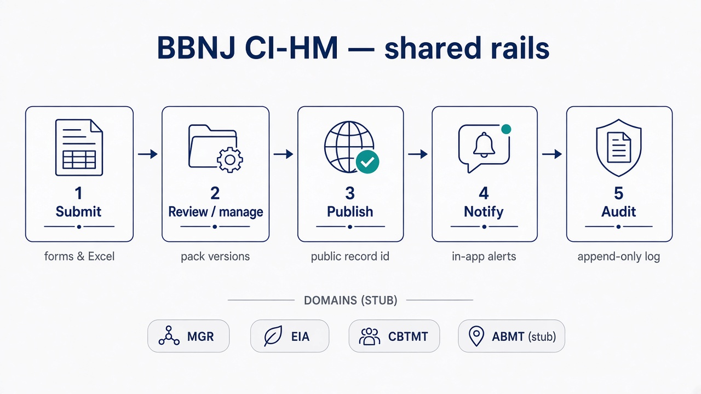
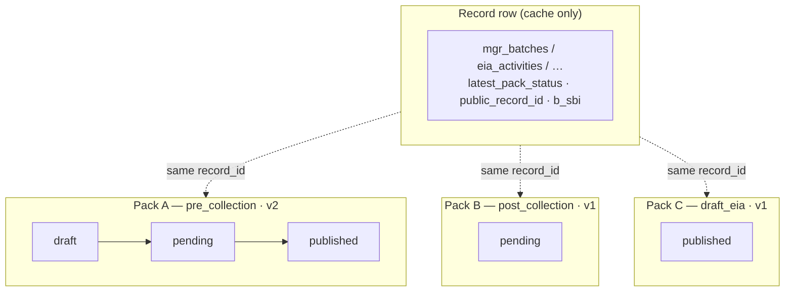
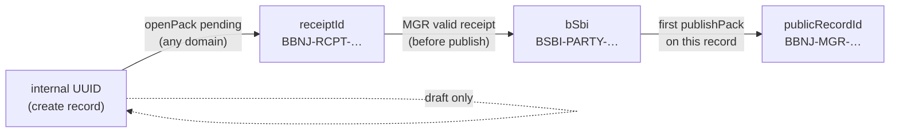
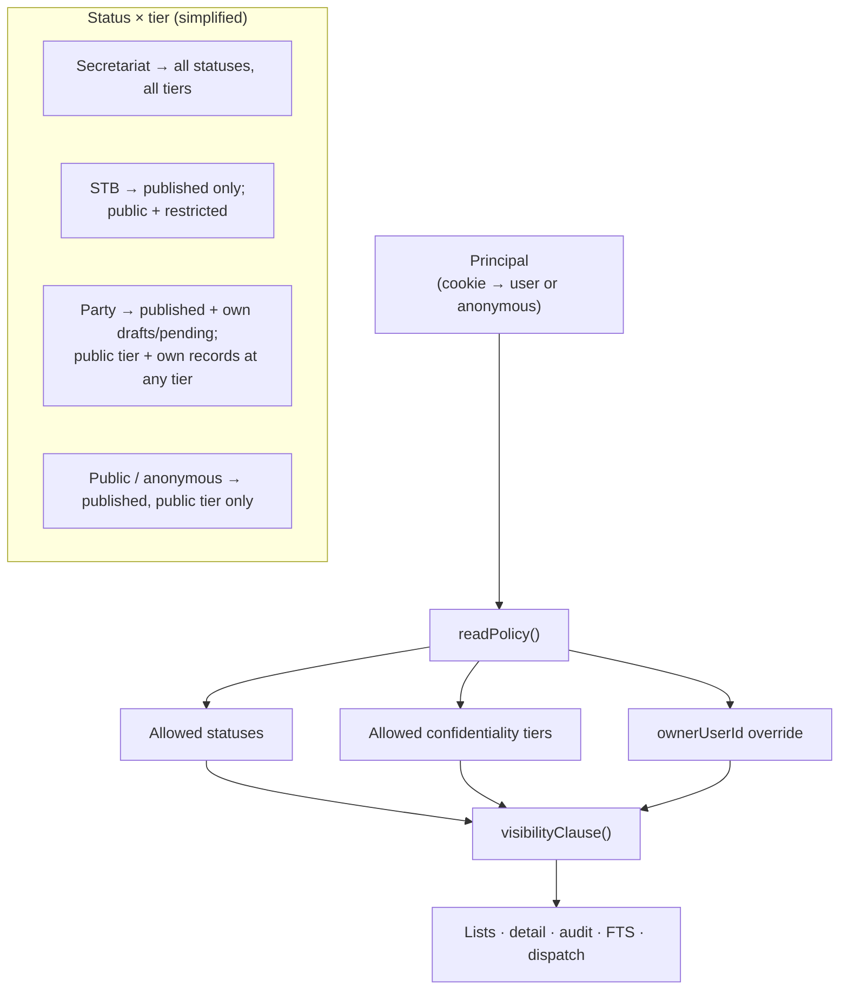
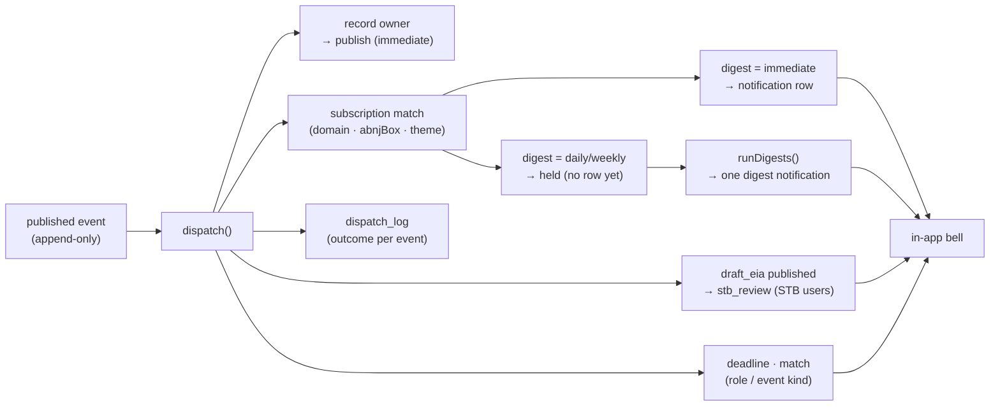

# Clearing House

Biodiversity Beyond National Jurisdiction

# BBNJ Cl-HM prototype

A **working prototype** of the BBNJ Agreement’s Clearing-House Mechanism (Cl-HM): one shared set of rails — **submit → review/manage → publish → notify → audit** — walked through marine genetic resources (MGR), environmental impact assessments (EIA), capacity-building / technology transfer (CBTMT), and a thin ABMT stub.

Built for **Party and Secretariat staff, reviewers, and anyone comparing a transactional desk to the interim informational pages**. MIT-licensed. Without prejudice to COP1.

Repository: [github.com/glen-w/BBNJ-CHM-proto](https://github.com/glen-w/BBNJ-CHM-proto)

<p align="center">
  
</p>

<p align="center">
  
</p>

---

## In brief

| | |
|---|---|
| **What it is** | A working **desk**, not a brochure site: Parties submit structured records; an authorised publisher releases them; subscribers get alerts; every step is auditable. |
| **Why it exists** | To show what a *transactional* Cl-HM adds beside the interim DOALOS informational set-up (documents, meetings, contacts) — a **design contrast**, not a critique. |
| **How to try it** | Clone or Docker — **no hosted public URL yet**. Five passwordless logins for local evaluation. |
| **What to open first** | [`docs/DEMO-SCRIPT.md`](docs/DEMO-SCRIPT.md) (10‑minute walk-through) · [`docs/ROADMAP.md`](docs/ROADMAP.md) · [`/exhibit`](http://localhost:3000/exhibit) (printable EOI one-pager) · [`/compare`](http://localhost:3000/compare) |

**Hands-on in one line:** `npm ci && npm run db:seed && npm run dev` — or `docker compose up --build` — then sign in at `/login`.

### What you can demonstrate today

- **Structured intake** — forms plus offline Excel (MGR pre-collection and EIA screening), with an error workbook for failed rows  
- **Identifiers in order** — receipt → Art 12 **B-SBI** at valid MGR receipt (before publish) → public record id at first publish; never swapped  
- **Pack status, not record status** — draft / pending / published on each pack so stages can coexist  
- **Roles enforced on the server** — Party, Secretariat, public, STB, non-State uploader; every refusal is logged  
- **Confidentiality tiers** — public / restricted / confidential on every list, export and notification  
- **Notify semantics** — in-app bell, hold + digest (no e-mail yet); optional digest CSV for the Secretariat  
- **Search** — policy-aware full-text search so restricted rows never leak to public readers  
- **Honesty labels** — Interim (DOALOS) vs Demo scenario badges so seed storylines are not read as real filings  
- **Evaluator exhibit** — printable `/exhibit` maps Session‑1 / EOI criteria to live routes and the sandbox inventory  
- **Literature** — a Zotero snapshot beside the four journeys: link-out only, and a paper shows on a record only when journey and place match  

Caveats stay in docs (and this README), not in product chrome: illustrative Party **XSD** (no real State), cookie logins, ABMT is a stub, notifications are in-app only, Excel is an Art 51.5 **pattern** not a WCAG certificate, PDF export is a stub, literature is a snapshot not a live library.

### Evaluation logins (`/login`)

| Username | Who it stands for | What they can do |
|---|---|---|
| `party.nfp` | Demo Party **XSD** | Own drafts/pending + published; submit MGR, EIA, CBTMT needs, ABMT stubs |
| `secretariat` | Authorised publishing role | Publish, import Excel, match CBTMT, facilitation notes, digests, full audit |
| `public` | Public reader | Published, public-tier only |
| `stb` | STB reviewer | Published + restricted; draft-EIA review queue |
| `nonstate.uploader` | Registered non-State provider | **CBTMT offers only** — other submissions refused and logged |

No passwords. A bad cookie = anonymous public.

### Interim set-up vs this desk

| | Interim (public DOALOS pages, as of Sep 2026) | This prototype |
|---|---|---|
| Intake | Documents and contact points | Forms + offline Excel + closed import loop |
| Identifiers | No Art 12 B-SBI visible yet (expected) | B-SBI at receipt; public id at publish (never swapped) |
| Versioning | Documents re-posted | Amend → pending v+1; material change re-notifies |
| Confidentiality | Not surfaced on public pages | Three tiers in every read path |
| Roles | Secretariat-published content | Five roles, server-enforced |
| Notify | None visible on public pages | Outbox → subscriptions → **in-app** digests (no SMTP) |
| Audit | Not surfaced on public pages | Append-only transitions + refusal log |

Full table and deep links: `/compare` (functions-first; docs-style page; not in primary nav). Printable one-pager: `/exhibit`. Talk-track: Excel = Art 51.5 pattern · language stub · ABMT without prejudice · literature is a Zotero snapshot · no hosted URL yet — see [`docs/SHIPPED.md`](docs/SHIPPED.md).

---

## Roadmap

Indicative path from this prototype to a fully-fledged Clearing-House Mechanism, assuming UN or other funding: phases, later treaty functions, deployment architecture, and the testing plan. Waves are not a COP1 workplan and not a hosting commitment.

**[Roadmap](docs/ROADMAP.md)**

---

## For implementers

Technical reference below. Product framing for non-engineers stops above.

### Quick start

```bash
nvm use            # Node 22 (.nvmrc); engines allow Node >=22 <27
npm ci
npm run db:seed    # idempotent seed (smoke fixtures + fixtures/bbnj-chm-seed-pack/csv/*.csv)
npm run dev        # http://localhost:3000
```

```bash
docker compose up --build
```

Health: [`/api/health`](http://localhost:3000/api/health). Walk-through: [`docs/DEMO-SCRIPT.md`](docs/DEMO-SCRIPT.md). Unattended: `npm run demo`.

> **Schema v7.** After a pull, if start throws `SchemaVersionError`, run `npm run db:reset` (Docker: `docker compose down -v`).

### The four locks (as built)

1. **Pack status, not record status** — `draft → pending → published` on each pack; records only cache the latest stage.  
2. **STB sees published draft EIAs only** — one consolidated comment per draft version.  
3. **Identifiers in order** — `internalId` → `receiptId` → **`bSbi`** (MGR receipt, before publish) → `publicRecordId` (first publish).  
4. **CBTMT match = row + event** — `cbtmt_matches` inserted atomically with `match_suggested`; shared-theme rule + human facilitation note (not ML).

### Key patterns (diagrams)

#### 1. Pack & outbox — status lives on packs, not records

A **pack** is the chain of append-only `events` rows sharing `(record_id, stage, version)`. The highest-`seq` row is the pack status. One record can carry many packs at once (Lock 1).


```mermaid
flowchart TB
  subgraph record["Record row (cache only)"]
    R["mgr_batches / eia_activities / …<br/>latest_pack_status · public_record_id · b_sbi"]
  end

  subgraph packA["Pack A — pre_collection · v2"]
    A1["draft"] --> A2["pending"] --> A3["published"]
  end

  subgraph packB["Pack B — post_collection · v1"]
    B1["pending"]
  end

  subgraph packC["Pack C — draft_eia · v1"]
    C1["published"]
  end

  record -.->|same record_id| packA
  record -.->|same record_id| packB
  record -.->|same record_id| packC
```

`UNIQUE (record_id, stage, version, status)` guarantees one transition per status; rows are never updated or deleted. `reconcile()` recomputes record caches from the outbox.

#### 2. Identifier mint order

Ids are minted inside the domain transaction that earns them. `bSbi` and `publicRecordId` are never interchangeable.


```mermaid
flowchart LR
  UUID["internal UUID<br/>(create record)"]
  RCPT["receiptId<br/>BBNJ-RCPT-…"]
  BSBI["bSbi<br/>BSBI-PARTY-…"]
  PRID["publicRecordId<br/>BBNJ-MGR-…"]

  UUID -->|"openPack pending<br/>(any domain)"| RCPT
  RCPT -->|"MGR valid receipt<br/>(before publish)"| BSBI
  BSBI -->|"first publishPack<br/>on this record"| PRID

  UUID -.->|"draft only"| UUID
```

#### 3. Read policy — one visibility clause everywhere

Every list, detail, feed, audit query, FTS hit and notification fan-out goes through `readPolicy()` + `visibilityClause()`. Nobody writes tier/status SQL by hand.


```mermaid
flowchart TD
  P["Principal<br/>(cookie → user or anonymous)"] --> RP["readPolicy()"]
  RP --> S["Allowed statuses"]
  RP --> T["Allowed confidentiality tiers"]
  RP --> O["ownerUserId override"]

  S --> Q["visibilityClause()"]
  T --> Q
  O --> Q

  Q --> R["Lists · detail · audit · FTS · dispatch"]

  subgraph roles["Status × tier (simplified)"]
    direction LR
    SEC["Secretariat → all statuses, all tiers"]
    STB["STB → published only;<br/>public + restricted"]
    PARTY["Party → published + own drafts/pending;<br/>public tier + own records at any tier"]
    PUB["Public / anonymous → published, public tier only"]
  end
```

#### 4. Notify dispatch — outbox → bell (with digest hold)

`dispatch()` runs synchronously after commit. Recipients are subscription matches ∩ users who can read the event. Daily/weekly subscribers are held until `runDigests()`.


```mermaid
flowchart LR
  EV["published event<br/>(append-only)"] --> DIS["dispatch()"]
  DIS --> OWN["record owner<br/>→ publish (immediate)"]
  DIS --> SUB["subscription match<br/>(domain · abnjBox · theme)"]
  SUB --> IMM["digest = immediate<br/>→ notification row"]
  SUB --> HOLD["digest = daily/weekly<br/>→ held (no row yet)"]
  HOLD --> DIG["runDigests()<br/>→ one digest notification"]
  DIS --> STB["draft_eia published<br/>→ stb_review (STB users)"]
  DIS --> DL["deadline · match<br/>(role / event kind)"]
  DIS --> LOG["dispatch_log<br/>(outcome per event)"]

  IMM --> BELL["in-app bell"]
  DIG --> BELL
  STB --> BELL
  DL --> BELL
```

`INSERT OR IGNORE` under `UNIQUE (user_id, event_id, kind)` makes replay safe; `scripts/replay-outbox.ts` must insert zero rows on a consistent database.

### Stack & scripts

Next.js 16 App Router · TypeScript · Zod 4 · shadcn/ui · `better-sqlite3` · `exceljs` · Node 22 · Docker Compose · MIT (`save-exact`, lockfile committed).

```bash
npm run smoke            # 36 acceptance tests on a temp DB
npm run db:seed          # idempotent; --if-empty for startup
npm run db:reset         # DEV/TEST ONLY (refused in production)
npm run db:check         # contracts:check + reconcile
npm run digest           # roll held publications into digest rows
npm run demo             # 17 narrated checkpoints; BASE_URL=… adds HTTP checks
npm run speed            # offline Excel loop timed on mocked connection profiles (--log appends to data/speed-runs.jsonl)
npm run contracts:check  # locked Zod contract loads
npm test                 # Vitest
```

Environment: `DATABASE_PATH` (default `data/chm.sqlite`); `SANDBOX_RESET=1` (or `force` in a hosted evaluation image) for Secretariat *Reset database*; `SANDBOX_BASIC_PASSWORD` (optional; with `SANDBOX_BASIC_USER`, default `bbnj`) for a browser HTTP Basic gate on a public URL — `/api/health` stays open; optional `SEED_PACK_DIR` (default `fixtures/bbnj-chm-seed-pack`) to point the CSV seed loader elsewhere.

**Latency / SIDS:** SSR HTML, native forms (works without client JS), no map tiles; offline Excel is the Art 51.5 pattern proof — not a WCAG certification ([`docs/ACCESSIBILITY.md`](docs/ACCESSIBILITY.md)). **Speed tests** live under Settings → Speed (`/settings?tab=speed`, or `npm run speed`): wire time is *calculated* from nominal bandwidth + RTT, parse time is *measured* with a validate-only pass — mocked, not a field measurement; trials go to `data/speed-runs.jsonl`, not the audit log.

### Guarantees (`npm run smoke`)

**36 tests** on a throwaway SQLite file: contract load, schema gate, identifiers, role predicates (incl. non-State uploader), public/STB never see draft/pending, FTS never leaks restricted/confidential, B-SBI timing, idempotency, STB queue, Lock 1 coexistence, tiers, import closed loops (MGR + EIA), amendments, ABMT stub, facilitation notes, digest export, reconcile/replay, seed idempotency.

### Layout (code map)

| Path | Purpose |
|---|---|
| `src/lib/contracts/events.ts` | Locked Zod contract |
| `src/lib/contracts/extensions.ts` | Implementation extensions only |
| `src/lib/db/` | Schema **v7** + `schema_version` gate |
| `src/server/policy.ts` | `can()` / `requireCan()` / single visibility clause |
| `src/server/packs.ts` | Version allocation, publish, amend |
| `src/server/notify.ts` / `digest.ts` | Dispatch, hold, digests |
| `src/server/{mgr,eia,cbtmt,abmt}.ts` | Domain journeys |
| `src/server/research.ts` / `src/app/research/` | Literature snapshot + related-research join (not a pack domain) |
| `src/server/seed-pack.ts` / `seedFromCsv.ts` / `parseCsv.ts` | CSV seed pack → domain APIs |
| `scripts/export-zotero-literature.ts` | One-shot Zotero → `research_items.csv` (needs `ZOTERO_SQLITE`) |
| `src/server/speed-lab.ts` | Mocked Excel-loop timing (`npm run speed` / Settings → Speed) |
| `src/app/` | Pages (incl. `/search`, `/exhibit`, `/institutional`, `/stb`), actions, templates, exports, health |
| `scripts/` | smoke, demo, seed, digest, replay-outbox, … |

### Further reading

| File | Purpose |
|---|---|
| [`docs/ROADMAP.md`](docs/ROADMAP.md) | Funded path, deployment, testing plan |
| [`docs/SHIPPED.md`](docs/SHIPPED.md) | Public honesty ledger (what smoke/demo assert) |
| `/exhibit` | Printable evaluator / EOI one-pager (live route) |
| [`docs/DEMO-SCRIPT.md`](docs/DEMO-SCRIPT.md) | Presenters / walk-through |
| [`docs/VISUAL-CHARTER.md`](docs/VISUAL-CHARTER.md) | UI identity |
| [`docs/ACCESSIBILITY.md`](docs/ACCESSIBILITY.md) | WCAG assessment |
| `fixtures/bbnj-chm-seed-pack/README.md` | Rich CSV seed pack (Interim mirrors + Demo scenarios) |

Internal planning archives (EOI checklists, original `proposal/` pack, hardening ledger) live in `internal/` — **gitignored**. After a fresh clone: `npm run internal:restore` (restores the long `SHIPPED-VS-DEFERRED` checklist and related planning notes; not required to run the desk).

### Scope notes (short)

- No hosted public URL; no SMTP; ABMT = stub; related-systems links in About this desk = links, not federation.  
- Illustrative values (30‑day EIA window, B-SBI shape, “material change”) are labelled implementation choices.  
- `/cbtmt` redirects to `/capacity`.

---

MIT · without prejudice to COP1.
