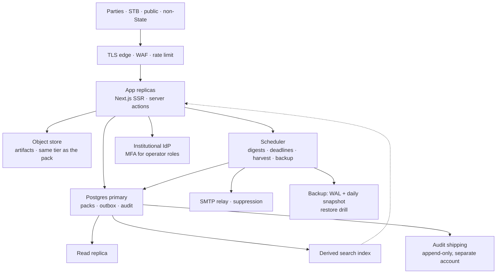

Type: PRODUCT
Authority: Indicative funded path only. Does not claim shipped behaviour (`docs/SHIPPED.md`) and does not define invariants (`src/lib/contracts/events.ts`).

# Clearing House

Biodiversity Beyond National Jurisdiction

## Roadmap

What this release already proves, and what a fully-fledged Clearing-House Mechanism would still need if the UN (regular budget, a voluntary trust fund, or a technical partner under a Secretariat agreement) or another funder pays for it. Waves and phases are **indicative**. They are not a COP1 workplan, not a hosting commitment, and not a claim that this repository is that platform. Themes can run in parallel. Identifiers, pack status, `readPolicy()`, and the outbox stay the substrate through every phase: later work adds seams on top of them.

### Funded path

Assume a multi-year build after this prototype, with a small core team (product, domain, engineering, accessibility, translation, operations) plus Secretariat and Party time for modalities. Money changes hosting and staffing. It does not change the Agreement, the honesty rules, or the low-bandwidth constraints in Art 51.5.

| Phase | What “done” means | Sits on |
|---|---|---|
| **0 — Now** | This repo. Clone or Docker. Five cookie roles. In-app notify. Asserted by `smoke` and `demo`. | SQLite, loopback, no public URL |
| **1 — Shared sandbox** | One TLS URL Parties can try together. Operator console for users, imports, digests, vocabularies. Still labelled evaluation. | Pathway 2: same app, reverse proxy, `SANDBOX_RESET`, still no production IdP |
| **2 — Operational Cl-HM** | Secretariat can receive, publish, notify and audit real filings for the functions COP has turned on. Human six-language chrome. WCAG 2.1 AA audit. Backups and a restore drill. | Pathway 3: Postgres, object store, SMTP, scheduler, institutional IdP |
| **3 — Full Art 51 platform** | The open-access platform in Art 51: all four parts as COP modalities specify them, public read API, webhooks, derived search, harvest/notify with related clearing-houses, COP activity statistics from the outbox. | Pathways 4 and 5: nodes subscribe; the index is derived; B-SBI stays singular |
| **4 — Long horizon** | Low-bandwidth channels beyond the browser, community protocols for traditional knowledge, a maintained ABNJ gazetteer, multi-region recovery, and a COP decision register that turns modalities into configuration. | Same rails. New products only where Art 51 or a COP decision names the function |

Phase 2 is the first moment a public URL may hold anything other than illustrative records. Until a Secretariat decision says otherwise, seed storylines stay labelled Interim or Demo and never mix with live filings.

### Waves (indicative)

| Wave | Focus | Would add |
|---|---|---|
| **Now (this repo)** | Working prototype | Shared rails, five roles, Excel pattern, in-app notify, FTS search, ABMT stub, Zotero literature snapshot, clone/Docker hands-on |
| **Wave A — Operate the desk** | Day-to-day Secretariat use | **Admin / user-management backend**; vocabularies; scheduled digests; import monitoring; richer audit filters; hosted **public URL** if required |
| **Wave B — Reach people** | Alerts beyond the browser | **SMTP** (optional SMS later) on the same outbox; **mailing lists / circulars** vs transactional notify; preference centre with real channels and unsubscribe |
| **Wave C — Trust & language** | Production posture | Institutional IdP / OAuth, TLS, session hardening; **six-language UI by human i18n** (treaty-text links already stubbed); formal WCAG audit |
| **Wave D — Content & geography** | Deeper records | File/object store for artifacts (today: references only); **tile/GIS neighbourhood** as progressive enhancement (schematic ABNJ diagram ships now); ABMT content beyond `proposal_stub` when COP1 clarifies |
| **Wave E — Interoperate** | Ecosystem | Versioned **API + webhooks**; federation / node protocol on the outbox; search beyond SQLite FTS; machine-readable exchange with related clearing-houses (today: named links only) |
| **Wave F — Treaty depth** | Functions Art 51 names, once COP modalities exist | Benefit-sharing notices, traditional-knowledge access rules, SEA, ABMT consultation-to-monitoring, COP reporting extracts |
| **Cross-cut** | Assist, hosting & proof | Guarded **LLM assist** (never authority) incl. CBTMT match-card UX (rule vs facilitation split); pick an **infrastructure pathway**; grow **testing** with each seam without replacing `npm run smoke` |

### Ambitious features (funded horizon)

These are the functions a fully-fledged platform would carry. Each one waits on a COP modality where the Agreement leaves the shape open. Until that decision, the desk keeps the stub or the link it has today.

| Area | Platform capability | Guardrail already in this repo |
|---|---|---|
| **MGR** | Pre-collection, post-collection and utilisation as full packs; benefit-sharing notices (non-monetary first; monetary only under a COP formula); links to repositories and databases, including DSI pointers | B-SBI at valid receipt, before publish; public id only at first publish; the two never swap |
| **Traditional knowledge** | Notices with community-defined access, a human consent flag, and a tier stricter than “public”; no bulk export of TK fields | `readPolicy()` on every list, export, search hit and notification |
| **EIA** | Screening through monitoring, public comment windows, STB consolidated comment as a formal instrument, strategic environmental assessment as its own pack type | Pack status so stages coexist; 30-day window stays an implementation choice until COP fixes one |
| **ABMT** | Proposal, consultation, decision, management plan, monitoring and review — content COP specifies, on the same rails | Stub is `proposal_stub` only; without prejudice until COP1 |
| **CBTMT** | Needs over time, offers from Parties and registered non-State providers, funding and training opportunities, match cards that show the **rule-found pair** beside the **human facilitation note** | Match is a shared-theme join plus a note, inserted atomically with the event |
| **COP reporting** | Activity statistics and national-report intake generated from published packs and the audit log; a public indicator page of counts | Counts come from the outbox. They are not a second register and not a surveillance product |
| **Geography** | Maintained ABNJ gazetteer (boxes, names, aliases) so literature and records join on a code; optional map tiles | Text neighbourhood and the schematic ship now; a map is never required to file or to read |
| **Artifacts** | Object store for DMPs, EIAs, management plans: virus scan, retention, the same confidentiality tier as the pack; stable URLs | Today the desk stores references, not files |
| **Languages** | Human catalogs in ar / zh / en / fr / ru / es for chrome, vocabularies and notifications; `contentLanguage` on the pack; labelled convenience translation only with human sign-off | Treaty text stays the official UN pages. UI strings stay English in this build |
| **Reach** | Plain-text e-mail, optional SMS for NFPs who ask for it, public RSS/Atom of public-tier events, one-click unsubscribe | Delivery is in-app. Digests already hold and roll up |
| **Exchange** | Versioned read/write API; HMAC webhooks; harvest or notify with ABSCH, BCH, OBIS, IOC-UNESCO, ISA, IMO, FAO — links become machine-readable where those bodies agree | Related-systems entries are names and URLs. No data flows |
| **Assist** | Opt-in assistant for field help, facilitation-note drafts, public-record summaries, and catalog-string drafts for a human editor | Off by default. Cannot mint ids, publish, match, or translate a filing into an official text |
| **Modalities as configuration** | A COP decision register: comment windows, identifier shapes, which pack types are open, which tiers exist — changed by an audited Secretariat action after a decision, not by a code fork | Illustrative values (30-day window, B-SBI shape, “material change”) stay labelled as implementation choices |

**Stays out**, funded or not: a blockchain or token for B-SBI; deep ABS/IP tracing inside the desk; forking ABSCH; ungoverned machine translation of the Agreement or of filings; a model that publishes, redacts, or matchmakes; map tiles as a requirement to submit; a second source of truth for identifiers.

### Translation — need and modalities

PrepCom3: English-first prototype, six UN languages later, with an **explicit caution against ungoverned AI translation**. The desk already opens the official BBNJ text in those six languages and persists the choice (Arabic RTL on the masthead only). UI strings stay English. That is a locale stub, not i18n.

The need is real: NFPs, non-State providers, STB reviewers and public readers do not all work in English, and Art 51.5 “without undue burden” includes language. Modalities to choose later — not all at once:

| Layer | Sensible modality | What not to do |
|---|---|---|
| **Treaty text** | Link the official UN pages (already stubbed). Never retranslate the Agreement. | Machine-translated articles as “the text”. |
| **Chrome / forms / notify** | Human (or professionally reviewed) message catalogs in ar / zh / en / fr / ru / es; RTL for Arabic; subscriber language on digests. | Shipping browser-plugin MT as an official offering. |
| **Controlled vocabularies** | Official equivalents for stages, themes, ABNJ boxes, confidentiality labels. | Free-text MT of coded terms. |
| **Record content** | Store `contentLanguage` on the pack; submitter language is the source. Optional later: labelled convenience translation vs a human-certified pack. | Silent overwrite of the filed language. |
| **Assisted MT** | Only as a human aid (draft a catalog string, never publish it). Log the modality; human sign-off. | Ungoverned MT of filings, notifications, or treaty cites. |

UI i18n is Wave C; record-language and vocabulary translation can trail chrome. Search and `visibilityClause()` must stay language-agnostic on identifiers and tiers. A funded translation programme is a standing cost (catalogs, review, regression screenshots per language), not a one-time string dump.

### AI / LLM integration

Shipped on purpose without models: CBTMT match is a **deterministic shared-theme join plus a human facilitation note**; search is policy-aware FTS; no auto-publish, no auto-redact.

If a later build uses an LLM, it is an **assistant**, not a rail. Same `readPolicy()` as every other read path; confidential and restricted rows never leave the allowed set; every assist is auditable.

| May help (human confirms) | Must not |
|---|---|
| Explain a form field; suggest themes or ABNJ boxes | Mint `receiptId` / B-SBI / `publicRecordId` |
| Draft a Secretariat facilitation note; surface **rule-found pair vs human facilitation** on CBTMT match cards | Publish, amend, or change confidentiality |
| Reformulate a public search query; summarise a **public** record | Replace CBTMT matchmaking or STB review |
| Help translate **UI catalogs** for a human editor | Translate treaty/filings as official; train on confidential packs |

Opt-in, off by default, labelled in the UI. PrepCom3’s translation caution still applies: a model is not a language modality. A funded deployment adds a private or Secretariat-contracted endpoint, an audit row for prompt and output, and an evaluation set built only from public fixtures.

### Notifications and mailing lists

Semantics are already in the outbox: `dispatch()` fans out after commit; immediate vs daily/weekly hold; `runDigests()`; material amendment re-notifies; Secretariat digest CSV. Delivery is **in-app only** (bell + `/notifications`). No SMTP, no scheduler in the image (`npm run digest` is cron-ready).

Two products share hygiene (preferences, unsubscribe, language) but should not share a mailbox:

1. **Transactional notify** — one row per published (or role-gated) event, already modelled. Next channel is SMTP on the same `dispatch()` adapters, then optional SMS. Keep plain-text mail for low-bandwidth readers; HTML is optional.
2. **Mailing lists / circulars** — Secretariat announcements, meeting notices, COP traffic. Not a record event. Needs its own list membership, not a fake `mgr_batches` row.

Preference centre (`/preferences` already has domain / ABNJ box / theme / cadence) would grow **channel**, **language**, and one-click unsubscribe (including `List-Unsubscribe` on SMTP). Bounces and suppression lists are ops, not outbox semantics. A public RSS/Atom of **public-tier published** events is a cheap extra channel that does not wait for SMTP.

Under a funded operate phase the scheduler is a real job (digest windows, deadline reminders, bounce processing), with a dead-letter the Secretariat can see on the audit page. SMS, where offered, is opt-in per user and carries the same visibility filter as the bell: a restricted event never leaves as a text to someone who cannot open the record.

### APIs and webhooks

Today’s machine seams are pull-only and policy-aware: `/api/health`, Excel templates, CSV/JSON/PDF exports, stable `/records/<publicRecordId>.json`. Related-systems links in About this desk are names, not exchange.

A production seam would stay on the same visibility clause:

- **Read API** — versioned, authenticated where the role is not public; public projection drops owner and user ids (already true on record pages).
- **Write / submit API** — the Excel closed loop is already a batch write path; an authenticated form-equivalent API is the same Zod contracts over HTTP.
- **Webhooks** — push on outbox events the subscriber is allowed to see; HMAC + retries; replay-safe because `UNIQUE (user_id, event_id, kind)` already is. Restricted/confidential must never fan out to a guessed URL.
- **Exchange** — harvest or notify related CHMs (ABSCH, BCH, OBIS, …) only after COP1 modalities; until then, stable URLs + JSON remain the honest seam.

OpenAPI, rate limits, and API keys / client credentials arrive with Wave C auth, not before. A funded interoperate phase publishes the OpenAPI document, consumer tests against it, and a public developer page that states which tiers a key may receive. National or scientific nodes subscribe; they do not mint a B-SBI.

### Admin / user-management backend

Roles and refusals are enforced; accounts are **seeded**, not operated. `active = 0` already falls back to anonymous. There is no self-registration, no invite, no NFP transfer, no vocabulary editor. Secretariat tools today are journey pages + `/audit` + sandbox reset.

Wave A is a dedicated operator surface, split by who is acting:

| Actor | Would manage |
|---|---|
| **System / Secretariat operator** | Users and roles; deactivate; import-run monitoring; digest schedule; vocabularies (ABNJ boxes, themes); sandbox seed/reset (eval only) |
| **Party NFP admin** | Who may submit for that Party; hand-off when the NFP changes |
| **Registered non-State** | Own profile; CBTMT-offer permission already exists as a role, not a self-serve flag |
| **STB secretariat support** | Review-queue assignment, consolidated-comment drafting; still one human sign-off per draft version |
| **Translation editor** | Message catalogs and vocabulary equivalents; cannot publish a pack |

Admin mutations belong in the audit log (same append-only habit as packs). Provisioning paths to decide: Secretariat-issued accounts vs institutional IdP vs (later) gated self-registration. Cookie logins stay a demo affordance until Wave C. A funded Phase 2 retires passwordless cookies on any URL that is not the evaluation sandbox.

### Deployment architecture

The rails (packs, identifiers, policy, outbox) should stay portable. Hosting is a fork, not a later wave that invalidates this repo.

| Pathway | When it fits | What it adds on top of this prototype |
|---|---|---|
| **1. Eval as now** | Clone, webinar, local review | SQLite, Docker bound to loopback, cookie roles, in-app notify. No public URL. |
| **2. Hosted sandbox** | Shared evaluation image | Same app + reverse-proxy TLS + public URL; `SANDBOX_RESET`; still SQLite; still no production IdP. |
| **3. Central production** | Secretariat-operated Cl-HM | Managed Postgres (or equivalent), object store for artifacts, SMTP, scheduler, backups/HA, institutional IdP. Next.js can stay the UI or sit on a smaller API. |
| **4. Hybrid central + federated** | Consolidated-study option: treaty-generated records vs links to external repositories | Node protocol / harvest on the **same outbox**; national or scientific nodes are subscribers, not a second source of truth for B-SBI. |
| **5. Search / index split** | When FTS5 or a single node is no longer enough | Solr / OpenSearch (or similar) as a **derived** index; the outbox remains canonical. |

UN / DOALOS hosting vs a technical partner is an institutional choice (IdP, SMTP, TLS, data residency). SIDS constraints do not change with the pathway: SSR HTML, native forms, offline Excel, no mandatory maps. Blockchain, IP tracing, and “fork ABSCH” stay non-goals.

**Production shape (Phase 2 and after).** One region first, a second region only when recovery targets require it. Indicative targets for a Secretariat-operated service: restore point within about an hour, restore time within a working day, practiced twice a year. Numbers are planning assumptions, not a service-level agreement.

Operating rules that keep the prototype’s guarantees:

- **Forward-only schema migrations.** `schema_version` still gates startup. A failed migration aborts the rollout. `db:reset` stays refused whenever `NODE_ENV=production`.
- **Sandbox and production never share a database.** Illustrative seed runs only in eval. Live filings are a separate instance with its own backups.
- **Secrets** live in the host’s secret store (UN or partner), not in the image. The image is built from the lockfile, scanned, and signed.
- **Logs** carry request ids and event ids. They do not carry pack bodies, tokens, or confidentiality-tier field values.
- **Deploys** are rolling or blue/green. Health (`/api/health`) must pass before traffic moves. A release is revertible to the previous image plus the previous migration only if that migration was backward-compatible; otherwise the restore drill is the rollback.
- **Data residency** follows the Secretariat’s hosting decision. Federation copies are projections the subscriber is allowed to see, not full replicas of confidential packs.
- **Low bandwidth is an architecture constraint.** HTML stays server-rendered. Forms work without client JavaScript. Excel remains a first-class intake path. Map tiles, if added, load only after an explicit choice and never block the page.

### Testing

A claim is **shipped** only when `npm run smoke` or `npm run demo` asserts it ([`SHIPPED.md`](SHIPPED.md)). New rails (SMTP, webhooks, admin, i18n, LLM assist) extend that gate — they do not replace it with a screenshot suite.

**Now.** Domain invariants on throwaway SQLite (`npm run smoke`, 36 tests: identifiers, role × action, FTS/export/notify never leak restricted/confidential, Excel closed loops, replay/reconcile, seed idempotency). Vitest units (`npm test`) on the same isolated harness. `npm run demo` walks 17 narrated checkpoints; `BASE_URL=…` adds HTTP status/body checks with each demo cookie against a running server (the server DB is not modified). `contracts:check` + `reconcile` + `replay-outbox`. Speed lab is **mocked** wire time, not a field measurement. [`ACCESSIBILITY.md`](ACCESSIBILITY.md) is a living gap analysis, not a WCAG certificate. GitHub Actions runs `contracts:check` + `smoke` on every push to `main` and on every pull request. There is no browser e2e gate and no axe/pa11y run yet.

| Layer | Now | Funded plan |
|---|---|---|
| **Invariants** | `smoke` P0/P1 on temp SQLite | Remains the merge gate on every phase. One new assertion per new rail (admin, SMTP, webhook, catalog, assist, gazetteer, benefit-sharing, SEA). A rail without an invariant does not ship |
| **Units** | Vitest (`src/**/*.test.ts`) | Same harness. Policy matrices stay the source of truth for `can()` / `visibilityClause()`. Postgres-specific SQL gets a second job against a throwaway database once pathway 3 exists; behaviour must match SQLite |
| **Journey / HTTP** | `demo` + optional `BASE_URL` cookie fetches | Browser e2e on [`DEMO-SCRIPT.md`](DEMO-SCRIPT.md) routes in CI. Native forms asserted **with client JS disabled**. Phase 2 adds a UAT script NFPs and Secretariat staff run on staging before a modality goes live |
| **Accessibility** | Charter + [`ACCESSIBILITY.md`](ACCESSIBILITY.md) remediations | axe / pa11y on priority routes (`/`, `/login`, `/mgr/new`, `/mgr/import`, `/eia/…`, `/capacity`, `/preferences`) on every PR. Keyboard and screen-reader pass on those routes before Phase 2. Third-party audit against UN web guidelines and WCAG 2.1 AA before real filings. Re-audit when a language or a major template changes |
| **Confidentiality** | FTS, lists, audit, feed, notify, export leak tests | The same matrix on **webhooks, SMTP, SMS, public API, derived search index, object store, LLM assist, federation harvest, COP statistics**. A seam that skips `readPolicy()` fails the build. IDOR cases on `/records/<id>`, exports, and artifact URLs. TK fields have their own stricter cases |
| **Channels** | In-app bell + digest CSV | SMTP fixtures (plain-text body, `List-Unsubscribe`, bounce/suppression). Webhook HMAC, retry, replay-zero. RSS public-tier only. SMS fixture asserts opt-in and tier filter |
| **Language** | Treaty-locale stub tests (not UI i18n) | Catalog completeness for six UN languages; RTL screenshot for Arabic; no missing-key fallback that leaks a key name; notifications honour subscriber language; vocabulary codes round-trip |
| **Latency / SIDS** | Speed lab (calculated bandwidth + measured parse) | Payload budget in CI (HTML and template size). Excel loop timed on a throttled profile in CI, still labelled mocked. Before Phase 2, one field measurement on a real constrained link, published as a measurement with its conditions — separate from the speed lab |
| **Security** | Cookie principals; every refusal logged | Dependency and image scan on every build. SAST on PRs. DAST against the sandbox. Authenticated pen-test before Phase 2 and after any auth or artifact-store change. Session fixation, logout, MFA enrolment for operator roles. Import formula-injection and zip/XML limits on Excel |
| **Contract / API** | Locked Zod byte-check | OpenAPI document generated from the same Zod contracts. Consumer tests. Webhook payload schema. Export columns stay RFC 4180. A COP modality change updates the contract and the smoke case together |
| **Load** | Single-node demo | Staging run at Party-scale (notifications fanning out, import of a large workbook, search under concurrent public reads) before Phase 2. Failure mode is a slow page, not a dropped audit row |
| **Ops / recovery** | Replay inserts zero; seed idempotent; reset refused in production | Backup restore onto a clean instance, then `reconcile` + `replay-outbox` insert zero. Migration rehearsal on a copy of production. Federation harvest test: zero new B-SBIs. Chaos case: kill a replica mid-publish; the pack is pending or published, never half-written |
| **Assist** | None (no model) | Eval harness on **public** fixtures only. Prompts and outputs in the audit log. Confidential packs never leave the allowed set. A regression set of “must refuse” prompts (mint an id, publish, translate a filing as official) |
| **Human** | [`DEMO-SCRIPT.md`](DEMO-SCRIPT.md) walk-through | NFP / Secretariat / STB UAT on staging. Professional translation review per language. Accessibility audit. Pen-test. Sign-off recorded against the phase, not against a screenshot |

**Gates.**

| Gate | Must pass | Runs where |
|---|---|---|
| **Merge** | `contracts:check`, `typecheck`, `test`, `smoke` | Every push and pull request |
| **Release candidate** | Merge gate, plus `demo`, browser e2e with JS off, axe on priority routes, image scan | Staging build |
| **Sandbox publish** | Release candidate, plus HTTP checks against the sandbox URL | Hosted evaluation |
| **Operational go-live** | Release candidate, restore drill, pen-test, WCAG audit, translation review, UAT with Secretariat | Phase 2, once per modality that accepts real filings |
| **Exchange go-live** | Operational gate, plus webhook replay-zero, harvest mints no identifier, consumer tests green | Phase 3 |

CI today runs `contracts:check` and `smoke` (`.github/workflows/ci.yml`). `typecheck`, `test`, `demo`, `BASE_URL` HTTP checks, and axe join the merge or release-candidate gate as those jobs exist. Hosted-sandbox reset and production IdP stay out of the merge gate until those pathways exist. Lower environments use synthetic Parties only — never a copy of live confidential packs.

Back to the [prototype README](../README.md).
