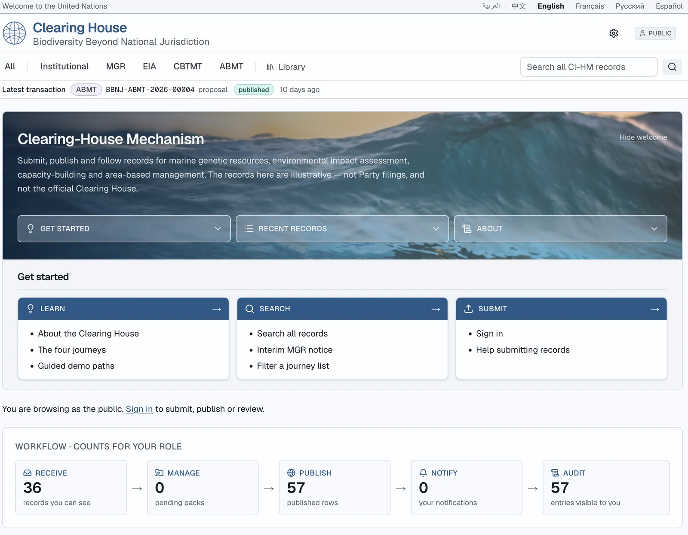
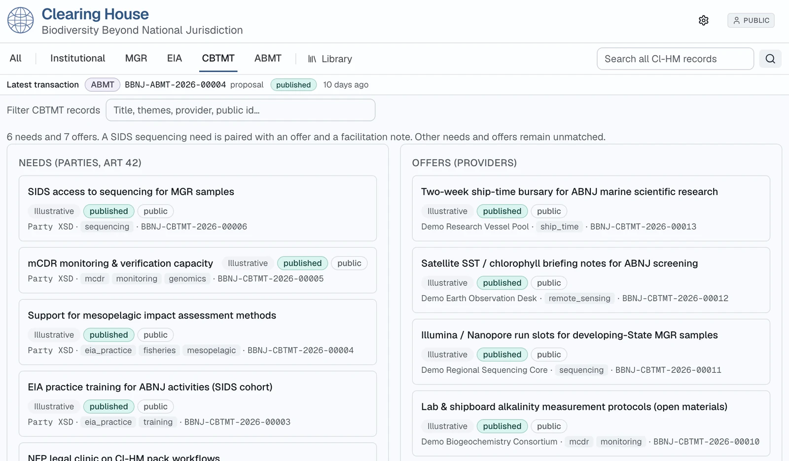
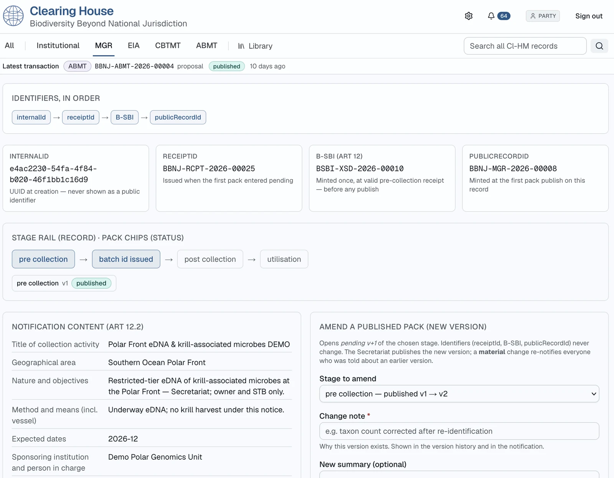

# Desk screenshots

Seeded views of the running Clearing House. Rail counts and minted identifiers follow the demo database. Claims that `npm run smoke` and `npm run demo` assert are listed in [`SHIPPED.md`](../SHIPPED.md).

The same files are embedded in the [README](../../README.md#what-the-desk-looks-like), the [walk-through](../DEMO-SCRIPT.md), and the [visual charter](../VISUAL-CHARTER.md).

## Public home

`/` as the anonymous public. Welcome band, Get started (Learn, Search, Submit), and the workflow strip. An anonymous reader’s pending-pack count stays at zero. Journey cards sit below this view.

## CBTMT — needs and offers

`/capacity` as the public. Party needs and provider offers in two columns. The list line names the seeded SIDS sequencing pair and says the other needs and offers remain unmatched. Match rows and facilitation notes are further down the page.

## MGR batch — identifiers and amend

`/mgr/[id]` as `party.nfp`, on the seeded Polar Front eDNA record (`mgr-southern-edna`). Identifier order, pre-collection v1 published, Art 12.2 fields, and the start of **Amend a published pack**.

